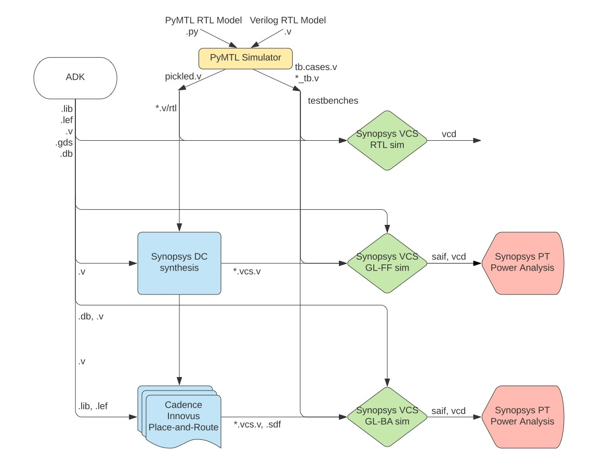
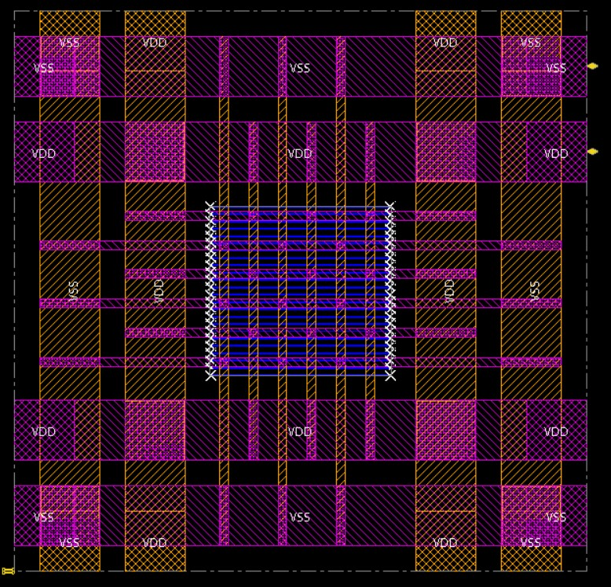
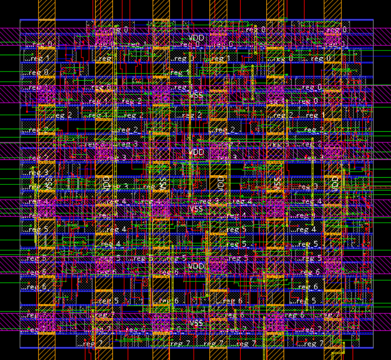
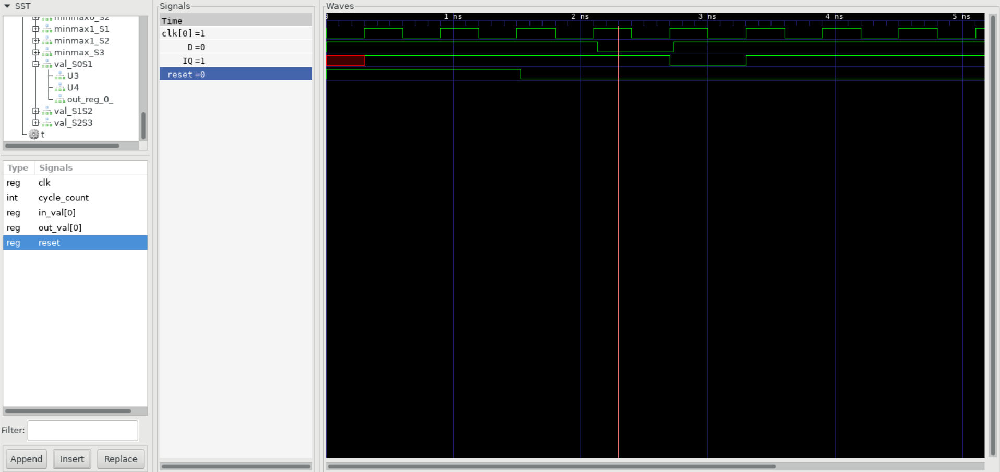
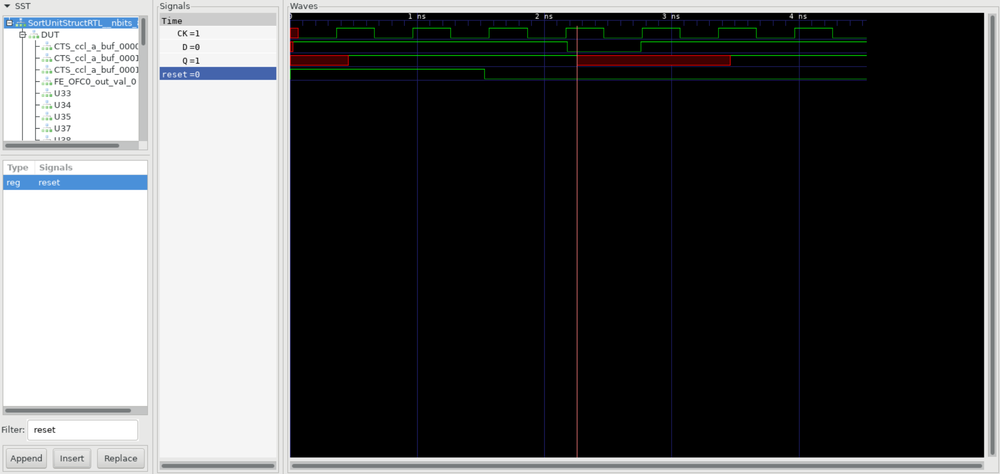

ECE 5745 Tutorial 6: Automated ASIC Block Flow
==========================================================================

 - Author: Christopher Batten, Yanghui Ou, Jack Brzozowski
 - Date: January 6, 2022

**Table of Contents**

 - Introduction
 - PyMTL-Based Testing, Simulation, Translation
 - Getting Started Using Mflowgen
 - Gathering RTL and Testbenches
 - Using Synopsys VCS for 4-State RTL Simulation
 - Using Synopsys Design Compiler for Synthesis
 - Using Synopsys VCS for Fast Functional Gate-Level Simulation
 - Using Synopsys PrimeTime for Post-Synth Power Analysis
 - Using Cadence Innovus for Place-and-Route
 - Using Synopsys VCS for Back-Annotated Gate-Level Simulation
 - Performing Hold Fixing on a Design
 - Using Synopsys PrimeTime for Post-Place-and-Route Power Analysis
 - Reviewing the Flow Summary
 - Using the Automated ASIC Flow for Design-Space Exploration
 - Using Verilog RTL Models
 - Pushing GCD Unit Through the Automated ASIC Flow

Introduction
--------------------------------------------------------------------------

The previous tutorial introduced students to the key tools used for
synthesis, place-and-route, and power analysis, but the previous tutorial
required students to enter commands manually for each tool. This is
obviously very tedious and error prone. An agile hardware design flow
demands automation to simplify rapidly exploring the area, energy, timing
design space of one or more designs. Luckily, Synopsys and Cadence tools 
can be easily scripted using TCL, and even better, the ECE 5745 staff have
created steps for automating the entire flow using `mflowgen`.

The tutorial will describe how to take your designs from RTL to layout. 
Mflowgen makes it relatively easy to achieve this by using modular steps 
to piece together a set of scripts that generates all the files we'll need 
to describe the final layout, and well as reports on power, timing, area, 
and much more. We often call such a set of scripts an "ASIC flow". However, 
it is critical for students to avoid thinking of the ASIC flow as a black 
box. As in all engineering, garbage-in means garbage-out. If you are not 
careful it is all too easy to use the ASIC flow to analyze a completely 
invalid design. This tutorial assumes you have already completed the 
tutorials on Linux, Git, PyMTL, Verilog, and the Synopsys/Cadence ASIC tools.

The following diagram illustrates the five primary tools we will be using
in ECE 5745. This is nearly the same flow diagram from the previous tutorial
since in part 1 of this tutorial, we are essentially just automating 
the exact same steps.



 1. We use the PyMTL framework to test, verify, and evaluate the
    execution time (in cycles) of our design. This part of the flow is
    exactly the same as ECE 4750. Note that we can write our RTL models
    in either PyMTL or Verilog. Once we are sure our design is working
    correctly, we can then start to push the design through the flow. The
    ASIC flow requires Verilog RTL as an input, so we can use PyMTL's
    automatic translation tool to translate PyMTL RTL models into Verilog
    RTL.

 2. We use Synopsys VCS to compile and run both 4-state RTL and gate-level 
    simulations. These simulations help us to build confidence in our design 
    as we push our designs through different stages of the flow. From these 
    simulations, we also generate waveforms in `.vcd` (Verilog Change Dump) 
    format, and we use `vcd2saif` to convert these waveforms into per-net 
    average activity factors stored in `.saif` format. These activity factors 
    will be used for power analysis. Gate-level simulation is an extremely 
    valuable tool for ensuring the tools did not optimize something away 
    which impacts the correctness of the design, and also provides an avenue 
    for obtaining a more accurate power analysis than RTL simulation. Though 
    Static Timing Analysis (STA) is much better because it analyzes all paths, 
    GL simulation also serves as a backup to check for hold and setup time 
    violations (chip designers must be paranoid!)

 3. We use Synopsys Design Compiler (DC) to synthesize our design, which
    means to transform the Verilog RTL model into a Verilog gate-level
    netlist where all of the gates are selected from a standard cell
    library. We need to provide Synopsys DC with higher-level
    characterization information about our standard cell library.

 4. We use Cadence Innovus to place-and-route our design, which means to
    place all of the gates in the gate-level netlist into rows on the
    chip and then to generate the metal wires that connect all of the
    gates together. Cadence Innovus will also handle power and clock
    routing. We need to provide Cadence Innovus with lower-level
    characterization information about our standard cell library. Cadence
    Innovus also generates reports that can be used to more accurately
    characterize area and timing.

 5. We use Synopsys PrimeTime (PT) to perform power-analysis of our
    design. This requires switching activity information for every net in
    the design (which comes from the PyMTL simulator) and parasitic
    capacitance information for every net in the design (which comes from
    Cadence Innovus). Synopsys PT puts the switching activity,
    capacitance, clock frequency, and voltage together to estimate the
    power consumption of every net and thus every module in the design.

Extensive documentation is provided by Synopsys and Cadence for Design 
Compiler, Cadence Innovus, and Synopsys PrimeTime. We have organized this 
documentation and made it available to you on the 
[public course webpage](http://www.csl.cornell.edu/courses/ece5745/asicdocs). 
The username/password was distributed during lecture.

The first step is to source the setup script, clone this repository from
GitHub, and define an environment variable to keep track of the top
directory for the project.

```
 % source setup-ece5745.sh
 % mkdir -p $HOME/ece5745
 % cd $HOME/ece5745
 % git clone git@github.com:cornell-ece5745/ece5745-tut6-asic-flow
 % cd ece5745-tut6-asic-flow
 % TOPDIR=$PWD
```

PyMTL-Based Testing, Simulation, Translation
--------------------------------------------------------------------------

As in the previous tutorial, our goal is to characterize the area,
energy, and timing for the sort unit from the PyMTL tutorial using the
ASIC tools. As a reminder, the sort unit takes as input four integers and
a valid bit and outputs those same four integers in increasing order with
the valid bit. The sort unit is implemented using a three-stage
pipelined, bitonic sorting network and the datapath is shown below.


Let's start by running the tests for the sort unit and note that the
tests for the `SortUnitStructRTL` will fail. You can just copy over your
implementation of the `MinMaxUnit` from when you completed the PyMTL
tutorial. If you have not completed the PyMTL tutorial then go back and
do that now.

Basically the MinMaxUnit should look like this:
```python
from pymtl3 import *

class MinMaxUnit( Component ):

  # Constructor

  def construct( s, nbits ):

    s.in0     = InPort ( nbits )
    s.in1     = InPort ( nbits )
    s.out_min = OutPort( nbits )
    s.out_max = OutPort( nbits )

    @update
    def block():

      if s.in0 >= s.in1:
        s.out_max @= s.in0
        s.out_min @= s.in1
      else:
        s.out_max @= s.in1
        s.out_min @= s.in0

  # Line tracing

  def line_trace( s ):
    return f"{s.in0}|{s.in1}(){s.out_min}|{s.out_max}"
```

Now running the following tests will pass.

```bash
 % mkdir -p $TOPDIR/sim/build
 % cd $TOPDIR/sim/build
 % pytest ../tut3_pymtl/sort
 % pytest ../tut3_pymtl/sort --test-verilog --dump-vtb
```

As we learned in the previous tutorial, the `--test-verilog` command line
option tells the PyMTL framework to first translate the sort unit into
Verilog, and then important it back into PyMTL to verify that the
translated Verilog is itself correct.

Let's experiment with an example which is valid PyMTL code, but is
not translatable to illustrate the importance of testing with
`--test-verilog`. Instead of using an `if` statement to implement the
`MinMaxUnit`, maybe we want to be clever and use the built-in `min` and
`max` Python functions like this:

```python
from pymtl3 import *

class MinMaxUnit( Component ):

  # Constructor

  def construct( s, nbits ):

    s.in0     = InPort ( nbits )
    s.in1     = InPort ( nbits )
    s.out_min = OutPort( nbits )
    s.out_max = OutPort( nbits )

    @update
    def block():
      s.out_max @= max( s.in0, s.in1 )
      s.out_min @= min( s.in0, s.in1 )
```

Rerun the tests on the pure-PyMTL implementation:

```bash
 % cd $TOPDIR/sim/build
 % pytest ../tut3_pymtl/sort/test/MinMaxUnit_test.py
```

All of the tests should pass, but now try running the tests with
`--test-verilog`.

```bash
 % cd $TOPDIR/sim/build
 % pytest ../tut3_pymtl/sort/test/MinMaxUnit_test.py --test-verilog
 % pytest ../tut3_pymtl/sort/test/MinMaxUnit_test.py -x --tb=short --test-verilog
...
E   pymtl3.passes.rtlir.errors.PyMTLSyntaxError:
E   In file /home/yo96/ece5745/ece5745-labs/sim/tut3_pymtl/sort/MinMaxUnit.py, Line 28, Col 18:
E     s.out_max @= max( s.in0, s.in1 )
E                 ^
E   - <_ast.Name object at 0x7f9d58048b50> function is not found!
```

The error message indicates that there is a translation error. In other
words, using the `min`/`max` functions is perfectly valid PyMTL code, but
the translation tool does not know how to translate these constructs into
Verilog. If you stick to the PyMTL usage rules posted on the course
website, your code will _probably_ be translatable. However, it is not
that difficult to write reasonable PyMTL code that is not translatable,
_and_ there is no guarantee the translation tool will catch translation
errors and produce such a nice error message as shown above. Translation
errors can result in run-time errors when you use `--test-verilog` or
they can even simulate correctly but produce errors when you try and
synthesize the design. So remember to always use `--test-verilog` before
using the ASIC flow, and to look for errors from the translation tool,
Verilator, and/or Synopsys DC. Make sure to fix the MinMaxUnit and re-run 
the tests using the `--dump-vtb` flag before moving on!

After running the tests we use the sort unit simulator to do the final 
translation into Verilog and to dump the `vtb` (Verilog TestBench) file 
that will allow us to do 4-state RTL simulation using Synopsys VCS.

```bash
 % cd $TOPDIR/sim/build
 % ../tut3_pymtl/sort/sort-sim --impl rtl-struct --stats --translate --dump-vtb
 num_cycles          = 105
 num_cycles_per_sort = 1.05
```

We now have both the translated Verilog for the sort unit, and the Verilog 
Testbench and Verilog testbench cases files for all of our tests and simulations, 
so we are ready to use the ASIC flow to quantitatively evaluate the area, 
energy, and timing of our design. It is extremely important to use the 
`--dump-vtb` flag on both the tests that you want to use for VCS simulation, and 
the simulation inputs that you want to use for power analysis. The Verilog 
Testbench is a translated version of your PyMTL simulation that VCS will use to 
run its simulation. Without these testbenches, these simulations will not be run 
by the automated flow. Make sure that you have these files dumped in your build 
folder before moving onto the ASIC flow. For the purposes of showing off some 
features of the ASIC flow, lets run a few more simulations before moving on:

```bash
 % cd $TOPDIR/sim/build
 % ../tut3_pymtl/sort/sort-sim --impl rtl-struct --input sorted-fwd --stats --translate --dump-vtb
 % ../tut3_pymtl/sort/sort-sim --impl rtl-struct --input sorted-rev --stats --translate --dump-vtb
 % ../tut3_pymtl/sort/sort-sim --impl rtl-struct --input zeros --stats --translate --dump-vtb
```

Getting Started Using Mflowgen
--------------------------------------------------------------------------

Mflowgen is a modular flow specification and build-system generator for ASIC 
and FPGA design-space exploration and Electronic Design Automation (EDA) being 
developed at Stanford University. The ECE5745 staff have been working with the 
folks at Stanford to help build this flow, and we are extremely excited to be 
bringing mflowgen into the ECE5745 course this year. Let's take a look into how 
we can start setting up and configuring an mflowgen build:

```bash
 % cd $TOPDIR/sim/tut3_pymtl/sort
 % cat .mflowgen.yml
 
 construct: ../../../asic/SortUnitStructRTL_BlockFlow.py
```

The `construct` key in your `.mflowgen.yml` file tells mflowgen which `flow.py` 
configuration script to use for this design folder. The .mflowgen.yml file must 
exist in the folder of the design you are trying to build a flow for. We can 
create a build using the `mflowgen run` command. The `--design` argument is 
simply the path to the .mflowgen.yml file. We'll create an asic build for the 
sort unit according to the configuration in `SortUnitStructRTL_BlockFlow.py`.

```bash
 % mkdir -p $TOPDIR/asic/build
 % cd $TOPDIR/asic/build
 % mflowgen run --design ../../sim/tut3_pymtl/sort
Targets: run "make list" and "make status"
```

Run the targets make list and make status to get a sense for what's included 
in the flow the ECE5745 staff have created for you. 

```bash
 % make list
Generic Targets:

 - list      -- List all steps
 - status    -- Print build status for each step
 - runtimes  -- Print runtimes for each step
 - graph     -- Generate a PDF of the step dependency graph
 - clean-all -- Remove all build directories
 - clean-N   -- Clean target N
 - info-N    -- Print configured info for step N
 - diff-N    -- Diff target N

Targets:

 -   0 : build-info
 -   1 : ece5745-block-gather
 -   2 : freepdk-45nm
 -   3 : brg-RTL-4-state-vcssim
 -   4 : brg-synopsys-dc-synthesis
 -   5 : PostSynth-Gate-Level-Simulation
 -   6 : brg-cadence-innovus-init
 -   7 : PostSynth-power-analysis
 -   8 : brg-cadence-innovus-blocksetup
 -   9 : brg-cadence-innovus-pnr
 -  10 : brg-cadence-innovus-signoff
 -  11 : PostPNR-Gate-Level-Simulation
 -  12 : PostPNR-power-analysis
 -  13 : brg-flow-summary

 % make status

Upcoming build order:

 - 0-build-info
 - 1-ece5745-block-gather
 - 2-freepdk-45nm
 - 3-brg-RTL-4-state-vcssim
 - 4-brg-synopsys-dc-synthesis
 - 5-PostSynth-Gate-Level-Simulation
 - 6-brg-cadence-innovus-init
 - 7-PostSynth-power-analysis
 - 8-brg-cadence-innovus-blocksetup
 - 9-brg-cadence-innovus-pnr
 - 10-brg-cadence-innovus-signoff
 - 11-PostPNR-Gate-Level-Simulation
 - 12-PostPNR-power-analysis
 - 13-brg-flow-summary

Status:

 - build -> 0   : build-info 
 - build -> 1   : ece5745-block-gather 
 - build -> 2   : freepdk-45nm 
 - build -> 3   : brg-RTL-4-state-vcssim 
 - build -> 4   : brg-synopsys-dc-synthesis 
 - build -> 5   : PostSynth-Gate-Level-Simulation 
 - build -> 6   : brg-cadence-innovus-init 
 - build -> 7   : PostSynth-power-analysis 
 - build -> 8   : brg-cadence-innovus-blocksetup 
 - build -> 9   : brg-cadence-innovus-pnr 
 - build -> 10  : brg-cadence-innovus-signoff 
 - build -> 11  : PostPNR-Gate-Level-Simulation 
 - build -> 12  : PostPNR-power-analysis 
 - build -> 13  : brg-flow-summary

 ```

`make list` gives us a list of all of the Makefile targets that we can run, 
where `make status` gives a more succinct view of what's been completed in 
the build thus far. Mflowgen does such a good job of abstracting information 
away from the user, it is tempting to hit `make` and walk away from the flow; 
however, it is important to understand what the flow is doing, and not to 
think of it as black box. To start to understand what mflowgen is doing, let's 
use some of the info targets provided in the makefile:

```bash 
 % make info-1

    +------------------------+
    |                        |
    +------------------------+
    |                        |
    | 1-ece5745-block-gather |
    |                        |
    +------------------------+
    |  rtl  |  testbenches   |
    +------------------------+
        |           |         
        |           V
        |           + 3-brg-RTL-4-state-vcssim
        |           + testbenches
        |           +
        |           + 5-PostSynth-Gate-Level-Simulation
        |           + testbenches
        |           +
        |           + 10-PostPNR-Gate-Level-Simulation
        |           + testbenches
        V
        + 3-brg-RTL-4-state-vcssim
        + rtl
        +
        + 4-brg-synopsys-dc-synthesis
        + rtl
        +
        + 5-PostSynth-Gate-Level-Simulation
        + rtl
        +
        + 10-PostPNR-Gate-Level-Simulation
        + rtl

Parameters

- design_name : SortUnitStructRTL
- design_path : undefined
- pad_ring    : False
- sim_path    : /work/global/jtb237/ece5745-tut6-asic-flow/asic/build/../sim

```

A "step" in mflowgen is simply a defined interface of inputs, scripts that 
process those inputs, and outputs them in a defined way. The block gather 
step is the step that brings all of our source RTL and testbenches into 
mflowgen. Antoher example of a step would be the synthesis step, which takes 
in the adk and the rtl, and outputs a gate-level netlist, a `.spef` file, 
and an `.sdc` file. We can see in the nice visual representation of the block 
gather step that the step has two outputs, rtl and testbenches. It also shows 
us which other steps use the rtl or testbenches as inputs. Take a look at the 
parameters listed. These parameters are used to configure the step. To see 
what all of the parameters do for a specific step, you can open the 
configure.yml for that step in the steps directory, located at {TODO add 
path to steps directory in mflowgen install}. 

Let's take a look at `SortUnitStructRTL_BlockFlow.py` located in the asic 
directory to see how we created the flow we have just constructed.

```bash
 % cd $TOPDIR/asic
 % less SortUnitStructRTL_BlockFlow.py
```

The `flow.py` file contains all of the information mflowgen needs to generate an 
ASIC flow for your design from standard steps. First, we tell mflowgen which ASIC 
Design Kit we are using (ADK) for our design, and which view we want to use. Some 
ADK's provide multiple stdcell libraries of different densities, and we could 
choose between them using the `adk_view` parameter. For the freepdk45nm library, 
we will stick to the standard view. Next, we can see a long list of parameters 
included in a python dictionary. These parameters are how we configure specific 
steps to do what we want them to. Parameters will be passed to all steps that 
have that parameter.

Let's take a look at step creation and connection. We create the special ADK step 
first. And then we instantiate all of the other steps below.

```python
  # ADK step

  g.set_adk( adk_name )
  adk = g.get_adk_step()

  # Custom steps

  info           = Step( 'info',                                 default=True )
  gather         = Step( 'ece5745-block-gather',                 default=True )
  vcsSim         = Step( 'brg-synopsys-vcs-sim',                 default=True )
  synth          = Step( 'brg-synopsys-dc-synthesis',            default=True )
  init           = Step( 'brg-cadence-innovus-init',             default=True )
  blocksetup     = Step( 'brg-cadence-innovus-blocksetup',       default=True )
  pnr            = Step( 'brg-cadence-innovus-pnr',              default=True )
  signoff        = Step( 'brg-cadence-innovus-signoff',          default=True )
  power          = Step( 'brg-synopsys-pt-power',                default=True )
  summary        = Step( 'brg-flow-summary',                     default=True )

  # Clone vcsSim

  rtlsim     = vcsSim.clone()
  glFFsim    = vcsSim.clone()
  glBAsim    = vcsSim.clone()

  # Clone pt-power

  synthpower = power.clone()
  pnrpower   = power.clone()
```

We start with an info step, this is not really a traditional "step" but rather
it's a make target that will provide information about this particular build. 
We instantiate all of the steps for the flow in this section. Note that we 
re-use the same vcs-sim step for all three stages of our VCS simulation. We 
achieve this using the Step.clone() function. We can rename the steps like 
this:

```python
  # Give clones new names

  rtlsim.set_name('brg-RTL-4-state-vcssim')
  glFFsim.set_name('PostSynth-Gate-Level-Simulation')
  glBAsim.set_name('PostPNR-Gate-Level-Simulation')
```

Then, we can use the `Graph.add_step()` function to add nodes to our graph. 
There are two ways of adding edges to the graph. The cleanest way is using 
`Graph.connect_by_name()`, which simply connects every common input and output 
name shared between the two steps. For example, the synthesis step outputs 
`design.vcs.v`, `design.sdc`, and `design.spef.gz`, all of which are inputs 
to the pnrpower step. Thus, using connect_by_name will connect all three of 
these edges in one fell swoop. However, for the pnrpower step, we do not want 
to use the netlist or spef file from synth in our power analysis, since we'll 
have the spef and updated gate-level netlist from Cadence Innovus by that point. 
In this case, we need to use the `Graph.connect()` function, and specifically 
connect *only* design.sdc, like this:

```python
  g.connect( synth.o( 'design.sdc'),     pnrpower.i('design.sdc')) #design.sdc
```

What if we have two steps with the same parameter name, but the parameters 
need to be different values? For example, there is a parameter called `simtype` 
for the vcs-sim step, which can either be rtl, or gate-level. We can update 
those after we update the parameters for all other steps like this:

```python 
  g.update_params( parameters )
  rtlsim.update_params({'simtype':'rtl'}, False)
  glFFsim.update_params({'simtype':'gate-level'}, False)
  glBAsim.update_params({'simtype':'gate-level'}, False)
  synthpower.update_params({'zero_delay_simulation': True}, False)
```

The first command updates all parameters with the parameters dictionary defined 
at the beginning of the flow.py file. To change any of these, we can call 
`update_params()` on that specific step. Now that we have a basic understanding 
of how graphs are built in mflowgen, we can start to push our design through 
the flow. 

Gathering RTL and Testbenches
-------------------------------------------------------------------------

To Build a specific step, we can either use the `make <step name>` or 
`make <step number>` targets. For example, let's build the build-info step:

```
 % make build-info

 _               _   _       _            _            __          
| |__    _   _  (_) | |   __| |          (_)  _ __    / _|   ___   
| '_ \  | | | | | | | |  / _` |  ______  | | | '_ \  | |_   / _ \  
| |_) | | |_| | | | | | | (_| | |______| | | | | | | |  _| | (_) | 
|_.__/   \__,_| |_| |_|  \__,_|          |_| |_| |_| |_|    \___/  
                                                                   

Design name      -- SortUnitStructRTL
Clock period     -- 0.6
ADK              -- freepdk-45nm
ADK view         -- stdview
```

This gives us a nice overview of what this build is configured for, which 
design it's building, at what clokc_period, and using which adk.

Next, let's build the first real step in the flow, the ece5745-block-gather 
step, this time using the step number. You should see all of the pymtl tests 
get run automatically. Ensure that these pass. Then you should see that all 
of the testbenches are getting copied over to the testbenches folder. 

```
 % make 1

                                      _                  _                               _     _                    
  ___    ___    ___                  | |   ___     ___  | | __            __ _    __ _  | |_  | |__     ___   _ __  
 / _ \  / __|  / _ \                 | |  / _ \   / __| | |/ /  ______   / _` |  / _` | | __| | '_ \   / _ \ | '__| 
|  __/ | (__  |  __/      _   _      | | | (_) | | (__  |   <  |______| | (_| | | (_| | | |_  | | | | |  __/ | |    
 \___|  \___|  \___|     (_) (_)     |_|  \___/   \___| |_|\_\           \__, |  \__,_|  \__| |_| |_|  \___| |_|    
                                                                         |___/                                      

+ pytest /work/global/jtb237/ece5745-tut6-asic-flow/asic/../sim/tut3_pymtl/sort/test -v --tb=short --test-verilog --dump-vtb --color=yes
============================= test session starts ==============================
platform linux -- Python 3.7.4, pytest-5.2.2, py-1.8.0, pluggy-0.13.0 -- /work/global/brg/install/venv-pkgs/x86_64-centos7/python3.7.4/bin/python3
cachedir: .pytest_cache
hypothesis profile 'default' -> database=DirectoryBasedExampleDatabase('/work/global/jtb237/ece5745-tut6-asic-flow/sim/build/.hypothesis/examples')
rootdir: /work/global/jtb237/ece5745-tut6-asic-flow/sim, inifile: pytest.ini
plugins: hypothesis-4.44.2, pymtl3-3.1.7
collecting ... collected 64 items

../tut3_pymtl/sort/test/MinMaxUnit_test.py::test_basic PASSED            [  1%]
../tut3_pymtl/sort/test/MinMaxUnit_test.py::test_random[4] PASSED        [  3%]
../tut3_pymtl/sort/test/MinMaxUnit_test.py::test_random[8] PASSED        [  4%]
.
.
.
../tut3_pymtl/sort/test/SortUnitStructRTL_test.py::test_random[16] PASSED [ 98%]
../tut3_pymtl/sort/test/SortUnitStructRTL_test.py::test_random[32] PASSED [100%]

======================== 22 passed, 42 skipped in 2.27s ========================
.
.
.
Copying testbenches of the format SortUnitStructRTL__nbits_8_<test_name>_tb.v(.cases)

Copying SortUnitStructRTL__nbits_8_test_basic_tb.v
Copying SortUnitStructRTL__nbits_8_test_basic_tb.v.cases
Copying SortUnitStructRTL__nbits_8_test_stream_tb.v
Copying SortUnitStructRTL__nbits_8_test_stream_tb.v.cases
Copying SortUnitStructRTL__nbits_8_test_dups_tb.v
Copying SortUnitStructRTL__nbits_8_test_dups_tb.v.cases
Copying SortUnitStructRTL__nbits_8_test_sorted_tb.v
Copying SortUnitStructRTL__nbits_8_test_sorted_tb.v.cases
Copying SortUnitStructRTL__nbits_8_test_random_8_tb.v
Copying SortUnitStructRTL__nbits_8_test_random_8_tb.v.cases
Copying SortUnitStructRTL__nbits_8_sort-rtl-struct-random_tb.v
Copying SortUnitStructRTL__nbits_8_sort-rtl-struct-random_tb.v.cases
Copying SortUnitStructRTL__nbits_8_sort-rtl-struct-sorted-fwd_tb.v
Copying SortUnitStructRTL__nbits_8_sort-rtl-struct-sorted-fwd_tb.v.cases
Copying SortUnitStructRTL__nbits_8_sort-rtl-struct-sorted-rev_tb.v
Copying SortUnitStructRTL__nbits_8_sort-rtl-struct-sorted-rev_tb.v.cases
Copying SortUnitStructRTL__nbits_8_sort-rtl-struct-zeros_tb.v
Copying SortUnitStructRTL__nbits_8_sort-rtl-struct-zeros_tb.v.cases
```

Let's take a quick look into the outputs folder for this step so we can 
make sure that all of the files were copied over as we expected:

```bash
 % cd $TOPDIR/asic/build/1-ece5745-block-gather/outputs/testbenches
 % ls -al 

total 128
drwxrwsr-x. 2 netid en-ec-brg-python-users 4096 Jan 14 16:44 .
drwxrwsr-x. 4 netid en-ec-brg-python-users  196 Jan 14 16:44 ..
-rw-rw-r--. 1 netid en-ec-brg-python-users 4137 Jan 14 16:44 SortUnitStructRTL__nbits_8_sort-rtl-struct-random_tb.v
-rw-rw-r--. 1 netid en-ec-brg-python-users 5459 Jan 14 16:44 SortUnitStructRTL__nbits_8_sort-rtl-struct-random_tb.v.cases
-rw-rw-r--. 1 netid en-ec-brg-python-users 4145 Jan 14 16:44 SortUnitStructRTL__nbits_8_sort-rtl-struct-sorted-fwd_tb.v
-rw-rw-r--. 1 netid en-ec-brg-python-users 5459 Jan 14 16:44 SortUnitStructRTL__nbits_8_sort-rtl-struct-sorted-fwd_tb.v.cases
-rw-rw-r--. 1 netid en-ec-brg-python-users 4145 Jan 14 16:44 SortUnitStructRTL__nbits_8_sort-rtl-struct-sorted-rev_tb.v
-rw-rw-r--. 1 netid en-ec-brg-python-users 5459 Jan 14 16:44 SortUnitStructRTL__nbits_8_sort-rtl-struct-sorted-rev_tb.v.cases
-rw-rw-r--. 1 netid en-ec-brg-python-users 4135 Jan 14 16:44 SortUnitStructRTL__nbits_8_sort-rtl-struct-zeros_tb.v
-rw-rw-r--. 1 netid en-ec-brg-python-users 5459 Jan 14 16:44 SortUnitStructRTL__nbits_8_sort-rtl-struct-zeros_tb.v.cases
-rw-rw-r--. 1 netid en-ec-brg-python-users 4113 Jan 14 16:44 SortUnitStructRTL__nbits_8_test_basic_tb.v
-rw-rw-r--. 1 netid en-ec-brg-python-users  477 Jan 14 16:44 SortUnitStructRTL__nbits_8_test_basic_tb.v.cases
-rw-rw-r--. 1 netid en-ec-brg-python-users 4111 Jan 14 16:44 SortUnitStructRTL__nbits_8_test_dups_tb.v
-rw-rw-r--. 1 netid en-ec-brg-python-users  477 Jan 14 16:44 SortUnitStructRTL__nbits_8_test_dups_tb.v.cases
-rw-rw-r--. 1 netid en-ec-brg-python-users 4119 Jan 14 16:44 SortUnitStructRTL__nbits_8_test_random_8_tb.v
-rw-rw-r--. 1 netid en-ec-brg-python-users 1378 Jan 14 16:44 SortUnitStructRTL__nbits_8_test_random_8_tb.v.cases
-rw-rw-r--. 1 netid en-ec-brg-python-users 4115 Jan 14 16:44 SortUnitStructRTL__nbits_8_test_sorted_tb.v
-rw-rw-r--. 1 netid en-ec-brg-python-users  477 Jan 14 16:44 SortUnitStructRTL__nbits_8_test_sorted_tb.v.cases
-rw-rw-r--. 1 netid en-ec-brg-python-users 4115 Jan 14 16:44 SortUnitStructRTL__nbits_8_test_stream_tb.v
-rw-rw-r--. 1 netid en-ec-brg-python-users  477 Jan 14 16:44 SortUnitStructRTL__nbits_8_test_stream_tb.v.cases
```

Great, the step copied all of the relevant testbenches into the testbenches 
folder! We can also check the status of a step using `make status`, step one 
now has the `done` tag.

```bash
 % make status 

 Status:

 - build -> 0   : build-info 
 - done  -> 1   : ece5745-block-gather 
 - build -> 2   : freepdk-45nm 
 - build -> 3   : brg-RTL-4-state-vcssim 
 - build -> 4   : brg-synopsys-dc-synthesis 
 - build -> 5   : PostSynth-Gate-Level-Simulation 
 - build -> 6   : brg-cadence-innovus-init 
 - build -> 7   : brg-cadence-innovus-power 
 - build -> 8   : brg-cadence-innovus-pnr 
 - build -> 9   : brg-cadence-innovus-signoff 
 - build -> 10  : PostPNR-Gate-Level-Simulation 
 - build -> 11  : PostSynth-power-analysis 
 - build -> 12  : RTL-power-analysis 
 - build -> 13  : PostPNR-power-analysis 
```

Let's bring in the ADK:

```
 % make 2

  __                                    _   _               _  _     ____                       
 / _|  _ __    ___    ___   _ __     __| | | | __          | || |   | ___|   _ __    _ __ ___   
| |_  | '__|  / _ \  / _ \ | '_ \   / _` | | |/ /  ______  | || |_  |___ \  | '_ \  | '_ ` _ \  
|  _| | |    |  __/ |  __/ | |_) | | (_| | |   <  |______| |__   _|  ___) | | | | | | | | | | | 
|_|   |_|     \___|  \___| | .__/   \__,_| |_|\_\             |_|   |____/  |_| |_| |_| |_| |_| 
                           |_|                                                                  
```

 Using Synopsys VCS for 4-State RTL Simulation
--------------------------------------------------------------------------

The next step is to do the 4-state simulation like we did in the manual tutorial. Let's start by running the info target for this step to understand how it works:

```bash
 % cd $TOPDIR/asic/build
 % make info-3

                 + 1-ece5745-block-gather
                 + testbenches
                 |
                 |                      + 1-ece5745-block-gather
                 |                      + rtl
                 |                      |
                 V                      V                                             
    +--------------------------------------------------------------------------------+
    | adk | testbenches | macrofiles | rtl | design.vcs.v | design.sdf | design.args |
    +--------------------------------------------------------------------------------+
    |                                                                                |
    |                            3-brg-RTL-4-state-vcssim                            |
    |                                                                                |
    +--------------------------------------------------------------------------------+
    |           vpd           |           vcd           |           saif             |
    +--------------------------------------------------------------------------------+
                                           |                          |               
                                           |                          V
                                           |                          + 12-RTL-power-analysis
                                           |                          + saif
                                           V
                                           + 12-RTL-power-analysis
                                           + vcd

Parameters

- clock_period     : 0.6
- debug            : False
- design_name      : SortUnitStructRTL__nbits_8
- dut_name         : DUT
- input_delay      : 0.05
- output_delay     : 0.05
- simtype          : rtl
- test_design_name : SortUnitStructRTL__nbits_8
- waveform         : True
``` 

From the info target, we can see that this step takes in the testbenches and 
the rtl, but also could take in the adk, a gate-level netlist, and an `.sdf` 
file, because it can be re-used for gate-level simulations. You can also see 
which parameters affect this step. We indicate that this is an rtl simulation, 
and also provide both the design_name and test_design_name. You may be wondering 
why we need both a design_name and test_design_name, especially if they are the 
same, but the answer will become more clear during the chip flow tutorial. The 
chip flow will involve adding a top verilog module wrapper around the pickled 
top module, and this wrapper will have a different name than the pickled module, 
and thus all of the testbenches will be named based on the pickled module, and 
the design_name will need to reference the actual device under test (DUT), which 
will be the wrapper module name. You may also notice that some of these parameters 
are defined despite not being in the `SortUnitStructRTL_BlockFlow.py` parameters 
dictionary. Steps can also define default values for their parameters in their 
respective `configure.yml` files, so we only need to specify them if we want to 
override them to something other than their default value. (For example, 
waveform=True is not specified in the flow.py, but we'll almost always want vcd 
files to use for debugging purposes or for saif generation for power analysis in 
the case of gate level simulation.)

```bash
 % make 3
 ...
 === Running run_sim.py -t sort-rtl-struct-zeros =======
 command: vcs  ./inputs/rtl/SortUnitStructRTL__nbits_8.v -full64 -debug_pp -sverilog +incdir+./inputs/testbenches  +lint=all -xprop=tmerge -top SortUnitStructRTL__nbits_8_tb ./inputs/testbenches/ SortUnitStructRTL__nbits_8_sort-rtl-struct-zeros_tb.v +vcs+dumpvars+outputs/vcd/sort-rtl-struct-zeros.vcd +incdir +./inputs/rtl -override_timescale=1ns/1ns -rad +vcs+saif_libcell -lca
 VCD to SAIF translator version R-2020.09-SP2 Synopsys, Inc.
 direct mapping all VCD instances
 processing header of VCD file: ./outputs/vcd/sort-rtl-struct-zeros.vcd
 processing value changes of VCD file: ./outputs/vcd/sort-rtl-struct-zeros.vcd
 generating backward SAIF file: ./outputs/saif/sort-rtl-struct-zeros.saif
 [PASSED]: test_basic
 [PASSED]: test_stream
 [PASSED]: test_dups
 [PASSED]: test_sorted
 [PASSED]: test_random_8
 [PASSED]: sort-rtl-struct-random
 [PASSED]: sort-rtl-struct-sorted-fwd
 [PASSED]: sort-rtl-struct-sorted-rev
 [PASSED]: sort-rtl-struct-zeros

```

The step automatically collects and runs simulations for every testbench that 
was collected in the gather step at the beginning of the flow. The vcs-sim step 
neatly prints out the results from each simulation directly in the terminal; 
however, if you ever want to revisit this log, or the log of any step for that 
matter, you can look at the `mflowgen-run.log` file within this step's folder 
like this:

```bash 
 % cd $TOPDIR/asic/build/3-brg-RTL-4-state-vcssim
 % less mflowgen-run.log
```

In the event that a test fails, you can review the report from the simv run 
in the reports folder. The reports are named by the test name. Although there 
should not be any compilation errors from running vcs, you can look at the vcs 
run log in the logs folder. 

```bash
 % cd $TOPDIR/asic/build/3-brg-RTL-4-state-vcssim/reports
 % less sort-rtl-struct-random.rpt

 Chronologic VCS simulator copyright 1991-2020
 Contains Synopsys proprietary information.
 Compiler version R-2020.12; Runtime version R-2020.12;  Jan 14 18:20 2022
 
   [ passed ]
 
 $finish called from file "./inputs/testbenches/SortUnitStructRTL__nbits_8_sort-rtl-struct-random_tb.v", line 132.
 $finish at simulation time                  427
            V C S   S i m u l a t i o n   R e p o r t 
 Time: 427 ns
 CPU Time:      0.480 seconds;       Data structure size:   0.0Mb
 Fri Jan 14 18:20:12 2022
```

Using Synopsys Design Compiler for Synthesis
--------------------------------------------------------------------------

Before running synthesis, let's dig into the step info to get a sense for 
some of the configuration options it provides, to see what the step is 
actually doing.

```bash
 % cd $TOPDIR/asic/build
 % make info-4
 ...
 Parameters

- clk_port                  : clk
- clock_period              : 0.6
- design_name               : SortUnitStructRTL__nbits_8
- extra_link_lib_dir        : ./inputs/adk
- flatten_effort            : 0
- gate_clock                : True
- high_effort_area_opt      : False
- input_delay               : 0.05
- nthreads                  : 16
- order:
  - designer-interface.tcl
  - setup-session.tcl
  - read-design.tcl
  - constraints.tcl
  - make-path-groups.tcl
  - compile-options.tcl
  - compile.tcl
  - generate-results.tcl
  - reporting.tcl
- output_delay              : 0.05
- reset_port                : reset
- reset_port2               : undefined
- saif_instance             : undefined
- topographical             : False
- uniquify_with_design_name : True

```

Here we can see key parameters like design_name, clock_period, input_delay, 
output_delay, etc. You can imagine how we might use these values to customize 
our build. There are also parameters set using their default value, like 
gate_clock, clk_port, and reset_port. Recall that we do not need to list 
parameters in our flow.py if we do not plan to change them from their default 
value. 

To actually run synthesis, all we need to do is run the
synthesis step like this:

```bash
 % cd $TOPDIR/asic/build
 % make 4
```

You will see mflowgen run some commands, start Synopsys DC, run some TCL
scripts, and then finish up. Essentially, the automated system is doing
the same thing as what we did in the previous tutorial, with a little 
more flexibility and options, and higher quality of results.

The `order` parameter details what order the `.tcl` scripts will be run 
in for this particular step. You can view the `.tcl` scripts like this:

```bash
 % cd $TOPDIR/asic/build/4-brg-synopsys-dc-synthesis/scripts
 % less constraints.tcl
```

You may notice the constraints.tcl file is quite similar to the constraints 
portion of the synthesis manual flow. Here, we set clock constraints, input 
and output delay, max fanout and transition. 

```bash 
 % less make-path-groups
 ... 
 dc_shell> set ports_clock_root [filter_collection \
                       [get_attribute [get_clocks] sources] \
                       object_class==port]
 dc_shell> group_path -name REGOUT \
                      -to   [all_outputs]
 dc_shell> group_path -name REGIN \
                      -from [remove_from_collection [all_inputs] $ports_clock_root]
 dc_shell> group_path -name FEEDTHROUGH \
                      -from [remove_from_collection [all_inputs] $ports_clock_root] \
                      -to   [all_outputs]
```

Here's an example of some useful commands that exist in the automated flow 
but not the manual flow. We set up path groups to help Synopsys DC's timing 
engine. The path group REGOUT starts at a register and ends at an output port. 
REGIN starts at an input port and ends at a register. FEEDTHROUGH paths start 
at an input port and end at an output port. Although the mflowgen steps 
have quite a bit more infrastructure around them than the manual flow, 
they are really doing the almost the exact same thing. Feel free to dig 
more into the other tcl scripts if you are curious about how this step works.


The first thing to do after you finish synthesis for a new design is to
_look at the log file_! We cannot stress how importance this is. mflowgen 
does some postcondition asserts as a sanity check, but this is not complete! 
Synopsys DC will often exit with an error or worse simply produce some 
warnings which are actually catastrophic. If you just blindly use 
`make brg-synopsys-dc-synthesis` or `make 4` and then move on to Gate-Level 
simulation and Cadence Innovus there is a good chance you will be pushing a 
completely broken design through the flow. There are many, many things that 
can go wrong. You may have used the incorrect file/module names in the 
`flow.py`, there might be code in your Verilog RTL that is not synthesizable, 
or you might have a simulation/synthesis mismatch such that the design you 
are pushing through the flow is not really what you were simulating. This is 
not easy and there is no simple way to figure out these issues, but you must 
start by looking for errors and warnings in the log file like this:

```bash
 % cd $TOPDIR/asic/build/4-brg-synopsys-dc-synthesis
 % grep Error logs/dc.log
 % grep Warning logs/dc.log
```

There should be no errors, but there will usually be warnings. The hard
part is knowing which warnings you can ignore and which ones indicate
something more problematic. Regardless of which RTL language you are using, you might see warnings
like this:

```
Warning: Layer 'metal1' is missing the attribute 'minArea'. (line 106) (TFCHK-012)
Warning: Layer 'metal2' is missing the attribute 'minArea'. (line 165) (TFCHK-012)
Warning: Layer 'metal3' is missing the attribute 'minArea'. (line 224) (TFCHK-012)
```

This is because of missing attributes within the rtk-tech.tf file. You can safely ignore these warnings.
You might also see warnings like this:

```
Warning: File 'setup-design-params.txt' was not found in search path. (CMD-030)
Warning: Module MinMaxUnit__nbits_8 contains unmapped components.  The output netlist might not be read back into the system. (VO-12)
Warning: The value of variable 'compile_preserve_subdesign_interfaces' has been changed to true because '-no_boundary_optimization' is used. (OPT-133)
```

You can also safely ignore these warnings. If you see errors or 
warnings related to unresolved module instances or unconnected nets, 
then you need to dig in and fix them. Again, there are no easy rules 
here. You must build your intuition into which warnings are safe to 
ignore.

When the synthesis is completed you can take a look at the resulting
Verilog gate-level netlist here:

```
 % cd $TOPDIR/asic/build/4-brg-synopsys-dc-synthesis
 % less outputs/design.v
```

This step is also setup to output a bunch of reports. However,
as discussed in the previous tutorial, we usually don't use these reports
since the post-synthesis area, energy, and timing results can be
significantly different than the more accurate post-place-and-route
results.

However, there is a "resources" report that can be somewhat useful. You
can view the resources report like this:

```
 % cd $TOPDIR/asic/build/4-brg-synopsys-dc-synthesis
 % less SortUnitStructRTL__nbits_8.mapped.resources.rpt

****************************************
Design : SortUnitStructRTL__nbits_8_MinMaxUnit__nbits_8_3
****************************************

Resource Report for this hierarchy in file
        ./inputs/rtl/SortUnitStructRTL__nbits_8.v
=============================================================================
| Cell           | Module         | Parameters | Contained Operations       |
=============================================================================
| gte_x_1        | DW_cmp         | width=8    | gte_56 (SortUnitStructRTL__nbits_8.v:56) |
=============================================================================


Implementation Report
===============================================================================
|                    |                  | Current            | Set            |
| Cell               | Module           | Implementation     | Implementation |
===============================================================================
| gte_x_1            | DW_cmp           | apparch (area)     |                |
===============================================================================

```

When using the more sophisticated `compile_ultra` command, Synopsys DC
can recognize common arithmetic operators and instead of treating those
operators as generic boolean logic, Synopsys DC will swap in what are
called "DesignWare" components. These DesignWare components are
pre-optimized at the gate-level for a generic gate-level library, which
then is eventually mapped to the specific standard-cell library used for
synthesis. There are DesignWare components for adders, shifters,
multipliers, floating-point units, etc. You can read more about the
DesignWare comments in the Synopsys documentation on the [public course
webpage](http://www.csl.cornell.edu/courses/ece5745/asicdocs).

The resources report tells you what DesignWare components Synopsys DC has
automatically inferred. As an aside, if you want to use more complicated
components (e.g., a floating point unit) then Synopsys DC cannot infer
these components automatically; you need to explicitly instantiate these
components in your Verilog. From the report we can see that Synopsys DC
has inferred a `DW_cmp` component. You can learn more about this
component from the
[datasheet](http://www.csl.cornell.edu/courses/ece5745/asicdocs/dwbb_datasheets/dw01_cmp6.pdf).

The data sheet mentions that it has several possible arithmetic
implementations it can choose from to meet the specific area, energy,
timing constraints. It has a ripple-carry implementation, a
delay-optimized parallel-prefix implementation, and an area-optimized
implementation. DesignWare components can significantly improve the area,
energy, and timing of arithmetic circuits.

Using Synopsys VCS for Fast Functional Gate-Level Simulation
--------------------------------------------------------------------------

The gate-level simulation step runs the exact same simulations as the 
4-state RTL simulations, only this time on the gate-level netlist. Let's 
just take a look at the info for this step to understand how we configured 
the step to do gate-level simulation instead of RTL simulation. 

```bash
 % cd $TOPDIR/asic/build
 % make info-5

 
       + 2-freepdk-45nm
       + adk
       |
       |         + 1-ece5745-block-gather
       |         + testbenches
       |         |
       |         |                      + 1-ece5745-block-gather
       |         |                      + rtl
       |         |                      |
       |         |                      |         + 4-brg-synopsys-dc-synthesis
       |         |                      |         + design.vcs.v
       |         |                      |         |
       V         V                      V         V                                   
    +--------------------------------------------------------------------------------+
    | adk | testbenches | macrofiles | rtl | design.vcs.v | design.sdf | design.args |
    +--------------------------------------------------------------------------------+
    |                                                                                |
    |                       5-PostSynth-Gate-Level-Simulation                        |
    |                                                                                |
    +--------------------------------------------------------------------------------+
    |           vpd           |           vcd           |           saif             |
    +--------------------------------------------------------------------------------+
                                           |                          |               
                                           |                          V
                                           |                          + 11-PostSynth-power-analysis
                                           |                          + saif
                                           V
                                           + 11-PostSynth-power-analysis
                                           + vcd

Parameters

- clock_period     : 0.6
- debug            : False
- design_name      : SortUnitStructRTL__nbits_8
- dut_name         : DUT
- input_delay      : 0.05
- output_delay     : 0.05
- simtype          : gate-level
- test_design_name : SortUnitStructRTL__nbits_8
- waveform         : True

```

We can see that this time around, we've connected the adk, as well as the 
gate-level netlist `design.vcs.v`. By using `g.connect_by_name()` between 
this step and the gather step to get the testbenches, we have also connected 
the rtl folder. Note that we do not *need* to connect the rtl folder, but 
the step will work correctly with or without it. In the parameters section, 
we set simtype to `gate-level`. The step knows that this is a fast-functional 
simulation because we did not connect an `.sdf` file to the inputs. Now that 
we understand how the step is configured, let's run the simulations:

```bash
 % cd $TOPDIR/asic/build
 % make 5
 .
 .
 .
 === Running run_sim.py -t sort-rtl-struct-zeros =======
command: vcs  ./inputs/design.vcs.v ./inputs/adk/stdcells.v -full64 -debug_pp -sverilog +incdir+./inputs/testbenches +lint=all -xprop=tmerge -top SortUnitStructRTL__nbits_8_tb ./inputs/testbenches/SortUnitStructRTL__nbits_8_sort-rtl-struct-zeros_tb.v +define+CYCLE_TIME=0.6 +define+VTB_INPUT_DELAY=0.03 +define+VTB_OUTPUT_ASSERT_DELAY=0.57 +vcs+dumpvars+outputs/vcd/sort-rtl-struct-zeros.vcd +delay_mode_zero +neg_tchk -hsopt=gates -y ./inputs/macrofiles -override_timescale=1ns/1ps -rad +vcs+saif_libcell -lca
VCD to SAIF translator version R-2020.09-SP2 Synopsys, Inc.
direct mapping all VCD instances
processing header of VCD file: ./outputs/vcd/sort-rtl-struct-zeros.vcd
processing value changes of VCD file: ./outputs/vcd/sort-rtl-struct-zeros.vcd
generating backward SAIF file: ./outputs/saif/sort-rtl-struct-zeros.saif
[PASSED]: test_basic
[PASSED]: test_stream
[PASSED]: test_dups
[PASSED]: test_sorted
[PASSED]: test_random_8
[PASSED]: sort-rtl-struct-random
[PASSED]: sort-rtl-struct-sorted-fwd
[PASSED]: sort-rtl-struct-sorted-rev
[PASSED]: sort-rtl-struct-zeros
=== Ending Simulations ================
```

Everything passed! Let's do some preliminary power analysis using all of the post synthesis information.

Using Synopsys PrimeTime for Post-Synth Power Analysis
--------------------------------------------------------------------------

We use Synopsys PrimeTime (PT) for power analysis. As described in the
previous tutorial, we start by doing power analysis directly on the 
gate-level model, which can be extremely time-consuming, especially for 
larger designs. Unfortunately, mflowgen automatically orders steps in 
topological order, and when two steps are at the same level, it sorts 
them alphabetically. If you run `make status` you'll notice that 
`PostSynth-power-analysis` comes after `brg-cadence-innovus-init`. 
Logically, it makes sense to do PostSynth-power-analysis --> 
brg-cadence-innovus-init. Therefore, we will run the steps 'out of 
order'. This is not a problem in mflowgen so long as the step is not 
dependent on the output of any unbuilt steps that come before it. We 
can run Synopsys PT for the PostSynth GL simulations like this:

```
 % cd $TOPDIR/asic/build
 % make 7
 OR
 % make PostSynth-power-analysis
```

We have setup the flow to display the final summary information after
this step. You can also display it directly like this:

```
 % cd $TOPDIR/asic/build/7-PostSynth-power-analysis/outputs
 % less power.summary.txt

==========================================================================
  Summary
==========================================================================

 power & energy
  sort-rtl-struct-random.vcd
      exec_time = 106 cycles
      power     = 2.367 mW
      energy    = 0.150541 nJ

  sort-rtl-struct-sorted-fwd.vcd
      exec_time = 106 cycles
      power     = 2.245 mW
      energy    = 0.142782 nJ

  sort-rtl-struct-sorted-rev.vcd
      exec_time = 106 cycles
      power     = 2.196 mW
      energy    = 0.139666 nJ

  sort-rtl-struct-zeros.vcd
      exec_time = 106 cycles
      power     = 1.161 mW
      energy    = 0.0738396 nJ

```

You can see the total exec time, power, and energy for your design
when running the given input (i.e., all of the simulation runs located 
in the build folder). You can see an overview of the power 
consumption here:

```
 % cd $TOPDIR/asic/7-PostSynth-power-analysis/reports/sort-rtl-struct-random/power
 % less SortUnitStructRTL__nbits_8.power.rpt
 ...
                        Internal  Switching  Leakage    Total
Power Group             Power     Power      Power      Power   (     %)  Attrs
--------------------------------------------------------------------------------
clock_network           6.354e-04    0.0000    0.0000 6.354e-04 (26.84%)  i
register                6.777e-04 2.083e-04 7.819e-06 8.938e-04 (37.75%)  
combinational           4.419e-04 3.887e-04 7.576e-06 8.382e-04 (35.41%)  
sequential                 0.0000    0.0000    0.0000    0.0000 ( 0.00%)  
memory                     0.0000    0.0000    0.0000    0.0000 ( 0.00%)  
io_pad                     0.0000    0.0000    0.0000    0.0000 ( 0.00%)  
black_box                  0.0000    0.0000    0.0000    0.0000 ( 0.00%)  

  Net Switching Power  = 5.970e-04   (25.22%)
  Cell Internal Power  = 1.755e-03   (74.13%)
  Cell Leakage Power   = 1.540e-05   ( 0.65%)
                         ---------
Total Power            = 2.367e-03  (100.00%)
```

The sort unit consumes ~2.4mW of power when processing random input data.
This is in the same ballpark as we saw in the previous tutorial. These
numbers are not identical to the previous tutorial, since the ASIC flow
uses more commands with different options than what we did manually. 
We are also doing this analysis Post-Synthesis, not Post-Place-and-Route. 
This can be extremely useful for iterating on designs up to the point of 
synthesis, as place and route can be rather time consuming for bigger designs. 

Power is the rate change of energy (i.e., energy divided by execution
time), so the total energy is just the product of the total power, the
number of cycles, and the cycle time. The cycle time is 0.6 ns, so the 
total energy is 106x0.6x2.367 = 150.5pJ. Since we are doing 100 sorts, 
this corresponds to about 1.50pJ per sort.

You can see a more detailed power breakdown by module here:

```
 % cd $TOPDIR/asic/7-PostSynth-power-analysis/reports/sort-rtl-struct-random/power
 % less SortUnitStructRTL__nbits_8.power.hier.rpt
...

                                      Int      Switch   Leak      Total
Hierarchy                             Power    Power    Power     Power    %
--------------------------------------------------------------------------------
SortUnitStructRTL__nbits_8            1.75e-03 5.97e-04 1.54e-05  2.37e-03 100.0
  val_S2S3 (SortUnitStructRTL__nbits_8_RegRst__Type_Bits1__reset_value_0_1) 1.08e-05 4.15e-07 1.23e-07 1.14e-05   0.5
  elm_S1S2__0 (SortUnitStructRTL__nbits_8_Reg__Type_Bits8_8) 1.07e-04 1.92e-05 6.33e-07 1.27e-04   5.4
  minmax0_S1 (SortUnitStructRTL__nbits_8_MinMaxUnit__nbits_8_0) 7.74e-05 5.87e-05 1.28e-06 1.37e-04   5.8
  elm_S1S2__1 (SortUnitStructRTL__nbits_8_Reg__Type_Bits8_7) 1.07e-04 1.89e-05 6.32e-07 1.27e-04   5.4
  minmax0_S2 (SortUnitStructRTL__nbits_8_MinMaxUnit__nbits_8_4) 7.64e-05 5.76e-05 1.36e-06 1.35e-04   5.7
  elm_S1S2__2 (SortUnitStructRTL__nbits_8_Reg__Type_Bits8_6) 1.07e-04 1.92e-05 6.33e-07 1.27e-04   5.3
  elm_S1S2__3 (SortUnitStructRTL__nbits_8_Reg__Type_Bits8_5) 1.06e-04 1.88e-05 6.32e-07 1.25e-04   5.3
  val_S0S1 (SortUnitStructRTL__nbits_8_RegRst__Type_Bits1__reset_value_0_0) 1.08e-05 7.74e-08 1.23e-07 1.10e-05   0.5
  minmax_S3 (SortUnitStructRTL__nbits_8_MinMaxUnit__nbits_8_1) 7.23e-05 5.70e-05 1.29e-06 1.31e-04   5.5
  elm_S0S1__0 (SortUnitStructRTL__nbits_8_Reg__Type_Bits8_0) 1.07e-04 1.92e-05 6.33e-07 1.27e-04   5.4
  elm_S0S1__1 (SortUnitStructRTL__nbits_8_Reg__Type_Bits8_11) 1.10e-04 2.07e-05 6.33e-07 1.32e-04   5.6
  elm_S0S1__2 (SortUnitStructRTL__nbits_8_Reg__Type_Bits8_10) 1.08e-04 2.05e-05 6.33e-07 1.29e-04   5.5
  elm_S0S1__3 (SortUnitStructRTL__nbits_8_Reg__Type_Bits8_9) 1.09e-04 2.04e-05 6.33e-07 1.30e-04   5.5
  val_S1S2 (SortUnitStructRTL__nbits_8_RegRst__Type_Bits1__reset_value_0_2) 1.08e-05 8.93e-08 1.23e-07 1.10e-05   0.5
  elm_S2S3__0 (SortUnitStructRTL__nbits_8_Reg__Type_Bits8_4) 1.04e-04 4.13e-06 6.31e-07 1.09e-04   4.6
  elm_S2S3__1 (SortUnitStructRTL__nbits_8_Reg__Type_Bits8_3) 1.03e-04 2.06e-05 6.33e-07 1.24e-04   5.3
  minmax1_S1 (SortUnitStructRTL__nbits_8_MinMaxUnit__nbits_8_3) 8.06e-05 6.19e-05 1.35e-06 1.44e-04   6.1
  elm_S2S3__2 (SortUnitStructRTL__nbits_8_Reg__Type_Bits8_2) 1.08e-04 2.20e-05 6.32e-07 1.30e-04   5.5
  minmax1_S2 (SortUnitStructRTL__nbits_8_MinMaxUnit__nbits_8_2) 7.32e-05 5.17e-05 1.28e-06 1.26e-04   5.3
  elm_S2S3__3 (SortUnitStructRTL__nbits_8_Reg__Type_Bits8_1) 1.04e-04 4.17e-06 6.31e-07 1.09e-04   4.6
1
```

Using Cadence Innovus for Place-and-Route
--------------------------------------------------------------------------

We use Cadence Innovus for placing and routing standard cells, but also
for power routing and clock tree synthesis. The Verilog gate-level
netlist generated by Cadence Innovus has no physical information: it is
just a netlist, so the Cadence Innovus will first try and do a rough
placement of all of the gates into rows on the chip. Cadence Innovus will
then do some preliminary routing, and iterate between more and more
detailed placement and routing until it reaches the target cycle time (or
gives up). Cadence Innovus will also route all of the power and ground
rails in a grid and connect this grid to the power and ground pins of
each standard cell, and Cadence Innovus will automatically generate a
clock tree to distribute the clock to all sequential state elements with
hopefully low skew. The automated flow for place-and-route is much more
sophisticated compared to what we did in the previous tutorial.

We utilize innovus' checkpointing ability to create sub-steps within the 
Place-and-Route flow. It can be extremely helpful to break pnr up into 
sub-steps. One reason is that Place-and-Route can take significantly 
longer than synthesis, so breaking it up into smaller steps can be helpful 
to get the design to a checkpoint that doesn't need to be rebuilt if a 
sub-step further down the line fails. Another key reason for checkpointing 
is that it provides us the ability to insert/swap-in optimization sub-steps 
for higher QOR, or to change out portions of the flow entirely, as we'll 
see in the chip flow. The standard place-and-route flow for block designs 
is as follows:

```python
'brg-cadence-innovus-init'
'brg-cadence-innovus-blocksetup'
'brg-cadence-innovus-pnr'
'brg-cadence-innovus-signoff'
```

The `init` step does everything in the manual flow up to and including 
`init_design`, and also sets some useful flags such as the ones listed 
below. We utilize an `adk.tcl` file provided to us in the ADK to create 
a standard interface that an ADK presents to mflowgen. This allows us to 
swap in whichever ADK we want with a two line change in our 
`SortUnitStructRTL_BlockFlow.py` file, and all of the scripts will still 
work correctly, only now for a different technology! In this course, we 
will only be utilizing freepdk45nm, but you can imagine how useful it might 
be to be able to swap in technologies quickly. From the `adk.tcl`, we read 
variables such as `$ADK_PROCESS` and `$ADK_MIN_ROUTING_LAYER_INNOVUS` to 
configure our design. We also use this step to set up path groups similarly 
to how we did in synthesis.

```
 set init_mmmc_file "./scripts/setup-timing.tcl"
 set init_verilog   "./inputs/design.v"
 set init_top_cell  $env(design_name)
 
 if {$env(extra_link_lib_dir)!=""} {
     set extra_link_lib_dir $::env(extra_link_lib_dir)
     set init_lef_file  [join "
                               [list ./inputs/adk/rtk-tech.lef         \
                                     ./inputs/adk/stdcells.lef         ]
                               [lsort [glob -nocomplain ./inputs/adk/*.lef]]
                               [lsort [glob -nocomplain $extra_link_lib_dir/*.lef]]
                       "]
 } else {
     set init_lef_file [join "
                               [list ./inputs/adk/rtk-tech.lef         \
                                     ./inputs/adk/stdcells.lef         ]
                               [lsort [glob -nocomplain ./inputs/adk/*.lef]]
                       "]
 }
 
 set init_gnd_net $ADK_GND_NETS
 set init_pwr_net $ADK_PWR_NETS
 
 #-------------------------
 # Init
 #-------------------------
 # Uniquify the design to use multiple instantiations of the same module
 set init_design_uniquify 1
 
 init_design
 
 setDesignMode -process $ADK_PROCESS -powerEffort High
 setDesignMode -bottomRoutingLayer            $ADK_MIN_ROUTING_LAYER_INNOVUS
 setDesignMode -topRoutingLayer               $ADK_MAX_ROUTING_LAYER_INNOVUS
 setAnalysisMode -analysisType OnChipVariation -cppr both
 
 ...
  
 # Create collection for each category
 
 set inputs   [all_inputs -no_clocks]
 set outputs  [all_outputs]
 set icgs     [filter_collection [all_registers] "is_integrated_clock_gating_cell == true"]
 set regs     [remove_from_collection [all_registers -edge_triggered] $$icgs]
 set allregs  [all_registers]
 
 # Group paths
 
 group_path -name In2Reg  -from $inputs  -to $allregs
 group_path -name Reg2Out -from $allregs -to $outputs
 group_path -name In2Out  -from $inputs  -to $outputs
 
 group_path -name Reg2Reg     -from $regs    -to $regs
 group_path -name Reg2ClkGate -from $allregs -to $icgs

```

We can use `mflowgen` to run Cadence Innovus like this:

```
 % cd $TOPDIR/asic/build
 % make 6

 OR 

 % make brg-cadence-innovus-init
 .
 .
 .
 ============================================================================ PASSES ============================================================================
 =================================================================== short test summary info  ====================================================================
 PASSED mflowgen-check-postconditions.py::test_0_
 PASSED mflowgen-check-postconditions.py::test_1_
 PASSED mflowgen-check-postconditions.py::test_2_
 PASSED mflowgen-check-postconditions.py::test_3_
 PASSED mflowgen-check-postconditions.py::test_4_
 PASSED mflowgen-check-postconditions.py::test_5_
 PASSED mflowgen-check-postconditions.py::test_6_
 PASSED mflowgen-check-postconditions.py::test_7_
 PASSED mflowgen-check-postconditions.py::test_8_
 9 passed in 0.02s
 
```

Again, it is important to look at the log file to ensure that nothing has 
gone wrong during any of these steps. In the init step, you should not have 
any errors. You may see warnings about how setting input delay on clk is not 
supported, or that group paths are not supported from the sdc, this is all 
safe to ignore (and it is actually why we re-specify path groups in innovus)! 
Note that we will also always get an Error about Genus not being installed, 
again, this is safe to ignore. When making your own designs, it will be 
important to build an intuition about which errors are safe to ignore.

```
 % cd $TOPDIR/asic/build/6-brg-cadence-innovus-init
 % grep ERROR logs/run.log
 % grep **WARN logs/run.log
```

While it is always a good idea to check the log files, usually we catch 
errors in Synopsys DC and after that we are all set. So if you see problematic 
errors in Cadence Innovus, you might want to go back and see if there were any 
errors in Synopsys DC.

Now let's build the `Blocksetup` step. This step uses the floorplan command to 
set an aspect ratio and utilization targets for the design just as we saw in 
the manual flow. It also is used to create a slightly more sophisticated power 
ring than the one we created in the manual flow tutorial. Run the blocksetup 
step like this:

```bash
 % cd $TOPDIR/asic/build
 % make 8

 OR 

 % make brg-cadence-innovus-blocksetup
 ============================================================================ PASSES ============================================================================
 =================================================================== short test summary info  ====================================================================
 PASSED mflowgen-check-postconditions.py::test_0_
 PASSED mflowgen-check-postconditions.py::test_1_
 PASSED mflowgen-check-postconditions.py::test_2_
 PASSED mflowgen-check-postconditions.py::test_3_
 PASSED mflowgen-check-postconditions.py::test_4_
 PASSED mflowgen-check-postconditions.py::test_5_
 PASSED mflowgen-check-postconditions.py::test_6_
 PASSED mflowgen-check-postconditions.py::test_7_
 PASSED mflowgen-check-postconditions.py::test_8_
 9 passed in 0.02s
```

Quickly scan the log file to make sure everything worked as planned. Unlike 
synopsys, there are some Errors that are safe in innovus, use your judgement 
to determine if something doesn't look quite right. Once you are assured 
that everything worked, let's take a look at the design checkpoint that 
innovus saves at the end of each step to see what we've built so far!

```bash
 % cd $TOPDIR/asic/build/8-brg-cadence-innovus-blocksetup
 % innovus -64 -nolog
 % innovus> source checkpoints/design.checkpoint/save.enc
```

Once the GUI has finished loading you will viewing a "MainWindow", enter
`source checkpoints/design.checkpoint/save.enc` at the `innovus 1>` prompt 
to actually open up the most recently placed-and-routed design in a 
"LayoutWindow". If you are not on the Cornell Wi-Fi and need to connect to 
ecelinux through the VPN, it might take a while for anything to show up in 
innovus, even after it finishes printing to the terminal, be patient! 



We can see the M1 stripes that we laid in for stdcells, as well as the power 
ring and its stripes. The power ring looks quite large compared to the previous 
tutorial, but the GCD unit is quite a small design, and we will eventually be 
connecting this design to a full pad ring in the chip flow, which will justify our 
power ring width choices. 

Let's run the bulk of the cadence flow, the pnr step. This is the step where we'll 
actually do placement, clock-tree synthesis and optimization and routing. We also 
have the ability to add in setup and hold time fixing for designs that have 
violating paths. This step will likely take the longest. For a simple design like 
this one, however, it should be no more than a few minutes. For more complex 
designs, do not be surprised to see pnr take 30-45 minutes or even longer. 

```bash
 % cd $TOPDIR/asic/build
 % make 9

 OR 

 % make brg-cadence-innovus-pnr
```

The automated system is setup to output a bunch of reports in the `reports` directory. 
This step does some pre-placement reporting, pre Clock-Tree Synthesis reporting, and 
hold time reporting. Feel free to look at these reports, however in the signoff step 
we will output many more reports that more accurately reflect your final design. 

An important function of the pnr step is its ability to perform hold time fixing. In 
the event that you push your design through the Innovus flow and move onto 
Back-Annotated Gate-level simulation only to find that your design has hold time 
violations, you will need to return back to this step and rebuild it. However, this 
time, you will need to use a more strict hold time and setup time constraint. To do 
this, you would need to update the parameters dictionary within 
`SortUnitStructRTL_BlockFlow.py` to include the parameters `setup_slack` and 
`hold_slack`. It is crucial that you include both of these parameters, otherwise you 
risk hold time fixes causing violations in setup time. Then, in order to actually 
rebuild the step properly, we will need to re-run the `mflowgen run` command we ran 
earlier, because our flow.py file has been modified. Then we will need to run the 
`make-clean` target on this step to remove its contents before rebuilding the step. 
You will also need to rebuild every step after the `pnr` step using the same 
`make-clean-N` `make-N` pattern.

```bash
 % mflowgen run --design ../../sim/tut3_pymtl/sort
 % make clean-9
 % make 9
```

If you'd like, you can take a look at the design.checkpoint the same way we 
did in the previous step. 

```bash
 % cd $TOPDIR/asic/build/9-brg-cadence-innovus-pnr
 % innovus -64 -nolog
 % innovus> source checkpoints/design.checkpoint/save.enc
```




```
 % make 10
  OR 
 % make brg-cadence-innovus-signoff
```

Let's continue to signoff, where all of our important output files from the 
innovus flow will be generated. Here is where we generate the `.gds`, `.sdf`, 
`.lef`, `.spef`, the updated gate-level netlist from innovus, as well as the 
final signoff timing, area, and power reports. Make sure to take a look at the 
signoff reports. You might want to start with the timing summary, and hold 
timing summary reports, which can be opened like this:

```bash
 % cd $TOPDIR/asic/build/10-brg-cadence-innovus-signoff/reports/innovus
 % less signoff.summary.gz
 ...

+--------------------+---------+---------+---------+---------+---------+---------+
|     Setup mode     |   all   | default | In2Out  | In2Reg  | Reg2Out | Reg2Reg |
+--------------------+---------+---------+---------+---------+---------+---------+
|           WNS (ns):|  0.118  |  0.000  |   N/A   |  0.486  |  0.124  |  0.118  |
|           TNS (ns):|  0.000  |  0.000  |   N/A   |  0.000  |  0.000  |  0.000  |
|    Violating Paths:|    0    |    0    |   N/A   |    0    |    0    |    0    |
|          All Paths:|   132   |    0    |   N/A   |   35    |   33    |   66    |
+--------------------+---------+---------+---------+---------+---------+---------+
 ...

 % cd $TOPDIR/asic/build/10-brg-cadence-innovus-signoff/reports/innovus
 % less signoff_hold.summary.gz
 ...
+--------------------+---------+---------+---------+---------+---------+---------+
|     Hold mode      |   all   | default | In2Out  | In2Reg  | Reg2Out | Reg2Reg |
+--------------------+---------+---------+---------+---------+---------+---------+
|           WNS (ns):|  0.020  |  0.000  |   N/A   |  0.020  |  0.161  |  0.093  |
|           TNS (ns):|  0.000  |  0.000  |   N/A   |  0.000  |  0.000  |  0.000  |
|    Violating Paths:|    0    |    0    |   N/A   |    0    |    0    |    0    |
|          All Paths:|   132   |    0    |   N/A   |   35    |   33    |   66    |
+--------------------+---------+---------+---------+---------+---------+---------+
...
```

Paths are organized into four groups: In2Reg, Reg2Out, In2Out, and
Reg2Reg path groups. In2Reg paths start at an input port and end at a
register; Reg2Out paths start at a register and end at an output port;
In2Out paths start at an input port and end at an output port; and
Reg2Reg paths start at a register and end at register. The following
diagram is from Chapter 1 of the [Synopsys Timing Constraints and
Optimization User
Guide](http://www.csl.cornell.edu/courses/ece5745/syndocs/tcoug.pdf).


We have setup the flow so that the tools have to fit all four of these
paths in a single cycle. The timing report shows the worst negative slack
(WNS) and total negative slack (TNS) within each path group. The overall
critical path for your design will be the worse critical path across all
four groups. WNS is calculated as the the target clock minus the longest
path. This is very important! If we have negative slack then the design
must run slower than this clock constraint, and if we have positive slack
then the design can run faster than this clock constraint. Again, the
actual cycle time is the calculated by subtracting the WNS from the
target clock period (and we must look across all four path groups to find
the overall critical path). So in this example the Reg2Reg path group has
the worst cycle time of 0.6 - 0.118 = 0.482ns.

Remember that hold time slack does not tell us anything about how quickly 
we can run our design. A hold time violation is a result of the 
contamination delay of a logical block being shorter than the hold time of 
a particular flip-flop such that the data arrives too quickly following 
a positive clock edge. Having a hold time violation simply means that you 
will need to go back to the `pnr` step using a stricter `hold_slack` and 
`setup_slack` so that buffers will be inserted to increase the contamination 
delay of violating paths. If you do not fix your hold time violations, 
your real design *will not work*, no matter how slow you run your design.

To figure out the actual critical path through the design you will need
to look in the detailed timing report for each path group. These timing
reports are organized such that the worst case path is shown first. This
means you cannot just look at one timing report for a path group! The
critical path might be in a different path group. So first, use the
timing summary report to figure out which path group contains the
critical path, and then look in the corresponding timing report to see
the critical path like this:

```bash
 % cd $TOPDIR/asic/build/10-brg-cadence-innovus-signoff/reports/innovus
 % less signoff_Reg2Out.tarpt.gz
 ...
Path 1: MET Setup Check with Pin elm_S1S2__2/out_reg_5_/CK 
Endpoint:   elm_S1S2__2/out_reg_5_/D (v) checked with  leading edge of 'ideal_
clock'
Beginpoint: elm_S0S1__3/out_reg_2_/Q (^) triggered by  leading edge of 'ideal_
clock'
Path Groups: {Reg2Reg}
Analysis View: analysis_default
Other End Arrival Time         -0.003
- Setup                         0.030
+ Phase Shift                   0.600
+ CPPR Adjustment               0.000
= Required Time                 0.567
- Arrival Time                  0.449
= Slack Time                    0.118
     Clock Rise Edge                      0.000
     + Drive Adjustment                   0.012
     + Source Insertion Delay            -0.077
     = Beginpoint Arrival Time           -0.065
     Timing Path:
     +----------------------------------------------------------------------------------------------------+ 
     |            Pin            | Edge |          Net           |   Cell    | Delay | Arrival | Required | 
     |                           |      |                        |           |       |  Time   |   Time   | 
     |---------------------------+------+------------------------+-----------+-------+---------+----------| 
     | clk[0]                    |  ^   | clk[0]                 |           |       |  -0.065 |    0.053 | 
     | CTS_ccl_a_buf_00010/A     |  ^   | clk[0]                 | CLKBUF_X3 | 0.001 |  -0.064 |    0.054 | 
     | CTS_ccl_a_buf_00010/Z     |  ^   | CTS_4                  | CLKBUF_X3 | 0.063 |  -0.001 |    0.117 | 
     | elm_S0S1__3/out_reg_2_/CK |  ^   | CTS_4                  | DFF_X1    | 0.001 |  -0.000 |    0.118 | 
     | elm_S0S1__3/out_reg_2_/Q  |  ^   | elm_S0S1__out[2]       | DFF_X1    | 0.106 |   0.105 |    0.223 | 
     | minmax1_S1/U17/A          |  ^   | elm_S0S1__out[2]       | INV_X1    | 0.000 |   0.105 |    0.223 | 
     | minmax1_S1/U17/ZN         |  v   | minmax1_S1/n6          | INV_X1    | 0.008 |   0.113 |    0.231 | 
     | minmax1_S1/U3/A2          |  v   | minmax1_S1/n6          | OR2_X1    | 0.000 |   0.113 |    0.231 | 
     | minmax1_S1/U3/ZN          |  v   | minmax1_S1/n7          | OR2_X1    | 0.048 |   0.162 |    0.280 | 
     | minmax1_S1/U18/B          |  v   | minmax1_S1/n7          | OAI211_X1 | 0.000 |   0.162 |    0.280 | 
     | minmax1_S1/U18/ZN         |  ^   | minmax1_S1/n15         | OAI211_X1 | 0.023 |   0.184 |    0.302 | 
     | minmax1_S1/U10/A1         |  ^   | minmax1_S1/n15         | AND3_X1   | 0.000 |   0.184 |    0.302 | 
     | minmax1_S1/U10/ZN         |  ^   | minmax1_S1/n19         | AND3_X1   | 0.046 |   0.230 |    0.348 | 
     | minmax1_S1/U23/C2         |  ^   | minmax1_S1/n19         | OAI211_X1 | 0.000 |   0.230 |    0.348 | 
     | minmax1_S1/U23/ZN         |  v   | minmax1_S1/n23         | OAI211_X1 | 0.022 |   0.252 |    0.370 | 
     | minmax1_S1/U7/A1          |  v   | minmax1_S1/n23         | AND2_X1   | 0.000 |   0.252 |    0.370 | 
     | minmax1_S1/U7/ZN          |  v   | minmax1_S1/n29         | AND2_X1   | 0.033 |   0.286 |    0.404 | 
     | minmax1_S1/U32/B1         |  v   | minmax1_S1/n29         | OAI21_X2  | 0.000 |   0.286 |    0.404 | 
     | minmax1_S1/U32/ZN         |  ^   | minmax1_S1/n32         | OAI21_X2  | 0.098 |   0.384 |    0.502 | 
     | minmax1_S1/U40/S          |  ^   | minmax1_S1/n32         | MUX2_X1   | 0.001 |   0.385 |    0.503 | 
     | minmax1_S1/U40/Z          |  v   | minmax1_S1__out_min[5] | MUX2_X1   | 0.064 |   0.449 |    0.567 | 
     | elm_S1S2__2/out_reg_5_/D  |  v   | minmax1_S1__out_min[5] | DFF_X1    | 0.000 |   0.449 |    0.567 | 
     +----------------------------------------------------------------------------------------------------+ 

```

This report is similar to the timing reports you saw in the previous
tutorial. Note that we can now see the clock network delay factored into
the beginning of the path. For paths that start at a register and end at
a register within the same design, we will see the clock network delay
factored both at the beginning and end of the path. If these delays are
not equal we will have either positive or negative clock skew. We have 
setup the tools so that these paths must also be completed within one 
cycle. For Reg2Out paths, there is no clock network delay at the end of the path, 
because the end point is an output port not a register. This might seem to 
penalize these REGOUT paths, but keep in mind that there will be a register 
in the _next_ module which will have some setup time. So we will still end 
up with a reasonable estimate even for REGOUT paths. The fanout and parasitic 
capacitance on each net is also shown which can be useful in identifying nets 
with unusually high loads. This critical path is similar but not exactly the 
same as we saw in the previous tutorial. This is because the ASIC flow uses 
more commands with different options than what we did manually.

You can view the area report like this:

```bash
 % cd $TOPDIR/asic/build/10-brg-cadence-innovus-signoff/reports
 % less area.rpt
Hinst Name                 Module Name                                                    Inst Count           Total Area               Buffer             Inverter        Combinational                 Flop                Latch           Clock Gate                Macro             Physical
----------------------------------------------------------------------------------------------------------------------------------------------------------------------------------------------------------------------------------------------------------------------------------------------------------
SortUnitStructRTL__nbits_8                                                                       391              776.188                4.788               32.984              290.738              447.678                0.000                0.000                0.000                0.000
 elm_S0S1__0               SortUnitStructRTL__nbits_8_Reg__Type_Bits8_0                            8               36.176                0.000                0.000                0.000               36.176                0.000                0.000                0.000                0.000
 elm_S0S1__1               SortUnitStructRTL__nbits_8_Reg__Type_Bits8_11                           8               36.176                0.000                0.000                0.000               36.176                0.000                0.000                0.000                0.000
 elm_S0S1__2               SortUnitStructRTL__nbits_8_Reg__Type_Bits8_10                           8               36.176                0.000                0.000                0.000               36.176                0.000                0.000                0.000                0.000
 elm_S0S1__3               SortUnitStructRTL__nbits_8_Reg__Type_Bits8_9                            8               36.176                0.000                0.000                0.000               36.176                0.000                0.000                0.000                0.000
 elm_S1S2__0               SortUnitStructRTL__nbits_8_Reg__Type_Bits8_8                            8               36.176                0.000                0.000                0.000               36.176                0.000                0.000                0.000                0.000
 elm_S1S2__1               SortUnitStructRTL__nbits_8_Reg__Type_Bits8_7                            8               36.176                0.000                0.000                0.000               36.176                0.000                0.000                0.000                0.000
 elm_S1S2__2               SortUnitStructRTL__nbits_8_Reg__Type_Bits8_6                            8               36.176                0.000                0.000                0.000               36.176                0.000                0.000                0.000                0.000
 elm_S1S2__3               SortUnitStructRTL__nbits_8_Reg__Type_Bits8_5                            8               36.176                0.000                0.000                0.000               36.176                0.000                0.000                0.000                0.000
 elm_S2S3__0               SortUnitStructRTL__nbits_8_Reg__Type_Bits8_4                            8               36.176                0.000                0.000                0.000               36.176                0.000                0.000                0.000                0.000
 elm_S2S3__1               SortUnitStructRTL__nbits_8_Reg__Type_Bits8_3                            8               36.176                0.000                0.000                0.000               36.176                0.000                0.000                0.000                0.000
 elm_S2S3__2               SortUnitStructRTL__nbits_8_Reg__Type_Bits8_2                            8               36.176                0.000                0.000                0.000               36.176                0.000                0.000                0.000                0.000
 elm_S2S3__3               SortUnitStructRTL__nbits_8_Reg__Type_Bits8_1                            8               36.176                0.000                0.000                0.000               36.176                0.000                0.000                0.000                0.000
 minmax0_S1                SortUnitStructRTL__nbits_8_MinMaxUnit__nbits_8_0                       49               56.924                0.000                5.852               51.072                0.000                0.000                0.000                0.000                0.000
 minmax0_S2                SortUnitStructRTL__nbits_8_MinMaxUnit__nbits_8_4                       50               57.722                0.000                6.384               51.338                0.000                0.000                0.000                0.000                0.000
 minmax1_S1                SortUnitStructRTL__nbits_8_MinMaxUnit__nbits_8_3                       50               57.456                0.000                6.384               51.072                0.000                0.000                0.000                0.000                0.000
 minmax1_S2                SortUnitStructRTL__nbits_8_MinMaxUnit__nbits_8_2                       49               56.924                0.000                5.852               51.072                0.000                0.000                0.000                0.000                0.000
 minmax_S3                 SortUnitStructRTL__nbits_8_MinMaxUnit__nbits_8_1                       52               55.860                0.000                6.916               48.944                0.000                0.000                0.000                0.000                0.000
 val_S0S1                  SortUnitStructRTL__nbits_8_RegRst__Type_Bits1__reset_value_0_0          3                6.118                0.000                0.532                1.064                4.522                0.000                0.000                0.000                0.000
 val_S1S2                  SortUnitStructRTL__nbits_8_RegRst__Type_Bits1__reset_value_0_2          3                6.118                0.000                0.532                1.064                4.522                0.000                0.000                0.000                0.000
 val_S2S3                  SortUnitStructRTL__nbits_8_RegRst__Type_Bits1__reset_value_0_1          3                6.118                0.000                0.532                1.064                4.522                0.000                0.000                0.000                0.000

```

This report is similar to what we saw in the previous tutorial. Note that
the total cell area is different from the total core area. The total cell area
includes just the standard cells, while the total area includes the "Net
Interconnect Area". To be totally honest, I am not quite sure what "Net
Interconnect Area" actually means, but we use the total core area in our
analysis. Again these numbers are not identical to the previous tutorial,
since the ASIC flow uses more commands with different options than what
we did manually.

We have written a little script to parse the reports and generate a
`summary.txt` file. This script takes care of looking across all four
path groups to fine the true cycle time that you should use in your
analysis. Note here that the 'chip_area' is quite large, but recall 
that this is including our power rails, and will look more natural 
with bigger and more complex designs, the key area point to see here 
is the core_area which capture stdcell area, macro area, and 
net interconnect area.

```
 % cd $TOPDIR/asic/build/10-brg-cadence-innovus-signoff/reports
 % less summary.txt

==========================================================================
  Summary
==========================================================================

design_name = SortUnitStructRTL__nbits_8

area & timing
  design_area   = 857.584 um^2
  stdcells_area = 857.584 um^2
  macros_area   = 0.0 um^2
  chip_area     = 11736.346 um^2
  core_area     = 1113.476 um^2
  constraint    = 0.6 ns
  slack         = 0.117 ns
  actual_clk    = 0.483 ns

```

While we do not use GUIs to drive our flow, we often use GUIs to analyze
the results. You can start the Cadence Innovus GUI to visualize the final
layout like this:

```bash
 % cd $TOPDIR/asic/build/10-brg-cadence-innovus-signoff
 % innovus -64
 % innovus> source checkpoints/design.checkpoint/save.enc
```

As mentioned in the previous tutorial, we call the resulting plot an
"amoeba plot" because the tool often generates blocks that look like
amoebas. You can zoom in to see how the standard cells were placed and
how the routing was done. You can turn on an off the visibility of metal
layers using the panel on the right. One very useful feature is to view the
hierarchy and area breakdown. This will be critical for producing
high-quality amoeba plots. You can use the following steps to highlight
various modules on the amoeba plot:

 - Choose _Windows > Workspaces > Design Browser + Physical_ from the
 - menu Hide all of the metal layers by pressing the number keys Browse
 - the design hierarchy using the panel on the left Right click on a
 - module, click _Highlight_, select a color

Another very useful feature is to highlight the critical path on the
amoeba plot using the following steps:

 - Choose _Timing > Debug Timing_ from the menu
 - Click _OK_ in the pop-up window
 - Right click on first path in the _Path List_
 - Choose _Highlight > Only This Path > Color_

You can see an example amoeba plot below. Note that you will need to use
some kind of "screen-capture" software to capture the plot.
You will also need to play with the colors to enable easily seeing
the various parts of your design.


Using Synopsys VCS for Back-Annotated Gate-Level Simulation
--------------------------------------------------------------------------

We are now prepared to use the `.sdf` we just generated from innovus to 
run a series of Back-Annotated Gate-Level simulations that will give us 
insight into realistic timing characteristics of our design. Remember, 
we have configured the same VCS-sim to back-annotated gate-level simulation 
by simply including an sdf file at the input, and we include the innovus 
gate-level netlist, which has been updated to include any new cells that 
may have been added by innovus during timing optimization/hold-time fixing. 
Feel free to run the info target for this step to see for yourself how 
everything is configured. We run the step just as the previous two VCS 
simulations:

```bash
 % cd $TOPDIR/asic/build
 % make 11
 OR
 % make PostPNR-Gate-Level-Simulation
 ...
 [FAILED]: test_basic
 [FAILED]: test_stream
 [FAILED]: test_dups
 [FAILED]: test_sorted
 [FAILED]: test_random_8
 [FAILED]: sort-rtl-struct-random
 [FAILED]: sort-rtl-struct-sorted-fwd
 [FAILED]: sort-rtl-struct-sorted-rev
 [FAILED]: sort-rtl-struct-zeros
 === Ending Simulations ================
```

Uh oh! We failed Back-Annotated Gate-Level simulation! Let's take a 
look at the simplest test's report file to see if we can figure out 
what's going wrong.

```
 % cd $TOPDIR/asic/build/10-PostPNR-Gate-Level-Simulation/reports
 % less test_basic.rpt
 ...
 "./inputs/adk/stdcells.v", 2123: Timing violation in SortUnitStructRTL__nbits_8_tb.DUT.val_S0S1.out_reg_0_
    $setuphold( posedge CK:2166, negedge D:2178, limits: (29,15) );
 
 
 "./inputs/adk/stdcells.v", 2124: Timing violation in SortUnitStructRTL__nbits_8_tb.DUT.val_S0S1.out_reg_0_
     $setuphold( posedge CK:2766, posedge D:2758, limits: (29,15) );
 
 
 The test bench received a value containing X/Z's! Please note
 that the VTB is pessmistic about X's and you should make sure
 all output ports of your DUT does not produce X's after reset.
 - Timestamp      : 4 (default unit: ns)
 - Cycle number   : 5 (variable: cycle_count)
 - line number    : line 4 in SortUnitStructRTL__nbits_8_test_basic_tb.v.cases
 - port name      : out[0] (out[0] in Verilog)
 - expected value : 0x00
 - actual value   : 0x0X
```

We can see two timing violations reported by vcs before we actually get 
to the check which caused the testbench to fail. The first timing 
violation says that the clk edge is at 2166ps, but data changes at 2178ps, 
or 12ps after the clk. The hold time for this flip-flop is 15ps. Therefore, 
it is likely that we have violated a hold time constraint, although it is 
possible that we have just severely violated setup time such that the data 
is 29+12 = 41ps late. There are a few different ways we can check this, but 
I think one of the easiest ways to diagnose problems with back-annotated 
gate-level simulations is to compare the waveforms with a passing 
fast-functional gate-level simulation. Debugging this way is very useful 
because the fast-functional simulation is almost like the "answer key" to 
what the signals *should* be in a given cycle. This makes it easier to 
distinguish setup violations from hold violations. Let's setup two waveform 
windows using gtkwave to analyze this problem.

```bash
 % cd $TOPDIR/asic/build/10-PostPNR-Gate-Level-Simulation/outputs/vcd 
 % gtkwave test_basic.vcd &
 % cd $TOPDIR/asic/build/5-PostSynth-Gate-Level-Simulation/outputs/vcd 
 % gtkwave test_basic.vcd &
```

The violating path went to the flip flop `out_reg_0` inside the val_S0S1 
module. In both gtkwave windows, open up the clk signal, the data bit of 
`out_reg_0` and the Q bit of `out_reg_0`. The resulting waveform for the 
fast functional simulation should look like this:




And the Back Annotated simulation should look like this:





Aha! If you zoom in near the portion of the waveform where the timing 
violation occurs, we can see clearly from the fast functional waveform 
that the valid bit is supposed to change after the clock. Therefore, 
this is a hold time violation. This makes sense, the val_S0S1 register 
connects directly to an input `in_val`. Input registered paths are the 
most likely to be affected by hold time constraints in simulation, 
because we the user tell the simulation when the data is arriving from 
externally, since we do not know what logic lies beyond our current 
design. To fix this, we will need to insert buffers into the violating 
path so that it will meet the hold time. To do this we must edit the 
`SortUnitStructRTL_BlockFlow.py` file, and go back to the PNR step. 

Performing Hold Fixing on a Design
--------------------------------------------------------------------------

In order to actually fix the hold time violations, we will need to enforce 
a stricter hold time constraint on the design in the pnr step. To do this, 
we will need to rebuild that step and all subsequent steps. We will also 
need to update the `SortUnitStructRTL_BlockFlow.py` file to tell the flow 
what hold time constraint to use. Open up the flow.py file using vim, 
geany, vscode, or your favorite text editor. In the parameters dictionary, 
add the following lines:

```python
    # Hold Fixing 
    'hold_slack'      : 0.070,
    'setup_slack'     : 0.035,
```

These numbers should work, but in your own designs you may need to do some 
trial and error to see what works best for your design. Now that we've updated 
the flow.py file, let's reconstruct mflowgen, and clean the necessary steps 
that need to be rebuilt.

```bash
 % mflowgen run --design ../../sim/tut3_pymtl/sort
 % make clean-9
 % make clean-10
 % make clean-11
```

We clean all the steps we did after pnr, since they will need to be rebuilt. Now let's build pnr again:

```bash
 % make 9
```

Look to the run.log in the logs directory of the step to see what's changed. 
Ctrl+F for `*** Finished Core Fixing` and below that you should find a little 
summary that tells you how many cells were added for hold time fixing:

```
*** Finished Core Fixing (fixHold) cpu=0:00:01.7 real=0:00:02.0 totSessionCpu=0:00:58.8 mem=1521.9M density=77.019% ***

*info:
*info: Added a total of 102 cells to fix/reduce hold violation
*info:
*info: Summary: 
*info:          102 cells of type 'BUF_X1' used
```

This is a good sanity check to make sure that we actually changed something about 
the netlist, if we use too loose of a constraint, innovus could still exit claiming 
that no hold time fixing was needed. 

Now, let's rebuild both signoff and Back-Annotated Sim. 

```bash
 % make 10
 % make 11
 ...
 [PASSED]: test_basic
 [PASSED]: test_stream
 [PASSED]: test_dups
 [PASSED]: test_sorted
 [PASSED]: test_random_8
 [PASSED]: sort-rtl-struct-random
 [PASSED]: sort-rtl-struct-sorted-fwd
 [PASSED]: sort-rtl-struct-sorted-rev
 [PASSED]: sort-rtl-struct-zeros
 === Ending Simulations ================
```

Great! We fixed the hold time violations, and now we can move on to power analysis.


Using Synopsys PrimeTime for Post-Place-and-Route Power Analysis
--------------------------------------------------------------------------

Earlier in this tutorial we utilized Synopsys PrimeTime to do power 
analysis at the Post-Synthesis stage of the flow. This provides a quick 
and dirty way to get power estimates on our design, but the 
Post-Place-and-Route power analysis will be much more accurate, since we 
will have the final netlist as well as a `.spef` file that can take into 
consideration the actual routing done between stdcells.

```
 % cd $TOPDIR/asic/build
 % make 12
 OR
 % make PostPNR-power-analysis
```

Similarly, this step outputs summary information, but also a power report and 
power hierarchy report. Feel free to open these files up to take a look and 
compare it to the power and energy from the Post-Synth energy analysis. 

These results are similar to what we saw in the previous tutorial.

Reviewing the Flow Summary
--------------------------------------------------------------------------

We have also created a simple flow summary step which collects the summary 
reports from Innovus signoff and Synopsys PT power analysis steps and puts 
them into one file thats easy to read. Let's run the flow summary here:

```bash
 % cd $TOPDIR/asic/build
 % make 13
 OR 
 % make brg-flow-summary
 ...
==========================================================================
  Summary
==========================================================================

design_name = SortUnitStructRTL__nbits_8

area & timing
  design_area   = 857.584 um^2
  stdcells_area = 857.584 um^2
  macros_area   = 0.0 um^2
  chip_area     = 11736.346 um^2
  core_area     = 1113.476 um^2
  constraint    = 0.6 ns
  slack         = 0.117 ns
  actual_clk    = 0.483 ns


==========================================================================
 Fast-Functional Power Analysis 
==========================================================================

 power & energy
  sort-rtl-struct-random.vcd
      exec_time = 106 cycles
      power     = 2.367 mW
      energy    = 0.150541 nJ

  sort-rtl-struct-sorted-fwd.vcd
      exec_time = 106 cycles
      power     = 2.245 mW
      energy    = 0.142782 nJ

  sort-rtl-struct-sorted-rev.vcd
      exec_time = 106 cycles
      power     = 2.196 mW
      energy    = 0.139666 nJ

  sort-rtl-struct-zeros.vcd
      exec_time = 106 cycles
      power     = 1.161 mW
      energy    = 0.0738396 nJ

==========================================================================
 Back-Annotated Power Analysis 
==========================================================================

 power & energy
  sort-rtl-struct-random.vcd
      exec_time = 106 cycles
      power     = 3.099 mW
      energy    = 0.197096 nJ

  sort-rtl-struct-sorted-fwd.vcd
      exec_time = 106 cycles
      power     = 2.817 mW
      energy    = 0.179161 nJ

  sort-rtl-struct-sorted-rev.vcd
      exec_time = 106 cycles
      power     = 2.724 mW
      energy    = 0.173246 nJ

  sort-rtl-struct-zeros.vcd
      exec_time = 106 cycles
      power     = 1.454 mW
      energy    = 0.0924744 nJ

```

While the summary report is a great tool to get quick overview of your 
design, do be sure to dig into the other reports to verify that your 
design is working as you expect. 

Using the Automated ASIC Flow for Design-Space Exploration
--------------------------------------------------------------------------

One of the key benefits of using an automated ASIC flow is that it
enables rapid design space exploration of different clock constraints,
input datasets, and design configurations. As we saw, mflowgen allows us to 
easily run power analysis on multiple datasets to make comparisons. In this 
section, we will briefly conduct two different experiments: (1) pushing the 
sort unit to run at different clock frequencies, and (2) comparing the 
pipelined sort unit to an unpipelined sort unit. This section will be working 
with the PyMTL RTL implementation, so if you attempted to push the Verilog 
RTL implementation in the previous section, we need to go back and regenerate 
the Verilog from the PyMTL RTL implementation. Of course, you should also 
feel free to try out these ideas using the Verilog RTL implementation.

```
 % cd $TOPDIR/sim/build
 % rm -rf *
 % ../tut3_pymtl/sort/sort-sim --impl rtl-struct --translate --dump-vtb
```

Recall that the sort unit had no problem meeting the 0.6ns clock
constraint. We usually want to push our designs until there is a couple
of percent negative slack (e.g., less than 5%) to ensure we are
accurately estimating the true peak performance of our design. With mflowgen, we have the ability to run multiple builds to sweep a range of clock frequencies with ease. All you need to do is update the flow.py script as follows:


```
 % cd $TOPDIR/asic
 % less flow.py

#-------------------------------------------------------------------------
# Flow parameters
#-------------------------------------------------------------------------

build_dir = '../../../sim/build'
files = [
  f'{build_dir}/SortUnitStructRTL__nbits_8__pickled.v',
  f'{build_dir}/sort-rtl-struct-random.verilator1.vcd',
]
top_name   = 'SortUnitStructRTL__nbits_8'
clk_period = 0.95 #ns
```

Then simply use `pyhflow` to reconfigure and rerun all the steps again.
We have added a `summary` step in the end that parses the area, timing,
and power reports for you and prints out useful information. You can
run the `summary` step as follow:

```
 % cd $TOPDIR/asic/build
 % pyhflow configure
 % pyhflow run summary

==========================================================================
 Summary
==========================================================================

design_name = SortUnitStructRTL__nbits_8

area & timing
  design_area   = 713.678 um^2
  stdcells_area = 713.678 um^2
  macros_area   = 0.0 um^2
  chip_area     = 1626.856 um^2
  core_area     = 1029.952 um^2
  constraint    = 0.95 ns
  slack         = 0.17 ns
  actual_clk    = 0.78 ns

power & energy
  sort-rtl-struct-random.verilator1.vcd
    exec_time = 105 cycles
    power     = 1.484 mW
    energy    = 0.148029 nJ
```

The summary is also saved to `summary.txt` in the `summary` directory.
You can access it like this:

```
% cd $TOPDIR/asic/build/summary
$ less summary.txt
```

Recall that earlier in the tutorial, we used a clock cycle constraint of
1ns and we had 0.02ns of positive slack. With a clock cycle constraint of
0.95ns we have 0.01ns of positive slack. This means the tools are still
meeting the clock constraint, but the positive slack is getting very
small meaning we are starting to approach the limit of how fast the sort
unit can run. The automated ASIC flow makes it relatively easy to
continue to push the design a bit. Here are the results for a variety of
different experiments with gradually decreasing clock constraints.

| clk (ns) | slack (ns) | ctime (ns) | area (um^2) | power (mW) |
|----------|------------|------------|-------------|------------|
| 1.00     |  0.155     | 0.845      | 701         |  1.45      |
| 0.95     |  0.164     | 0.786      | 707         |  1.46      |
| 0.90     |  0.08      | 0.820      | 711         |  1.44      |
| 0.85     |  0.15      | 0.700      | 720         |  1.44      |
| 0.80     |  0.14      | 0.660      | 735         |  1.47      |
| 0.75     |  0.082     | 0.668      | 826         |  1.57      |
| 0.70     |  0.176     | 0.524      | 734         |  1.40      |
| 0.65     |  0.181     | 0.469      | 736         |  1.39      |
| 0.60     |  0.126     | 0.474      | 737         |  1.39      |
| 0.55     |  0.113     | 0.437      | 732         |  1.39      |
| 0.50     |  0.067     | 0.433      | 734         |  1.39      |
| 0.45     |  0.046     | 0.414      | 736         |  1.40      |
| 0.40     |  0.009     | 0.391      | 799         |  1.64      |
| 0.35     |  0.002     | 0.348      | 972         |  2.05      |
| 0.30     |  -0.022    | 0.322      | 916         |  1.96      |
| 0.25     |  -0.065    | 0.315      | 1001        |  2.32      |
| 0.20     |  -0.114    | 0.314      | 994         |  2.30      |

where `clk` is the clock constraint, and `ctime` is the cycle time. So we
can make a couple important observations. First, as we decrease the clock
constraint, the area and power generally increase. This is to be expected
since a more aggressive clock constraint requires the tools to use larger
cells and potentially more sophisticated logic implementations. In
addition, a more aggressive clock constraint results in a shorter cycle
time (higher clock frequency) which also increases the power. If we just
take these results on face value, then it appears the optimum cycle time
is approximately ~0.65ns. However, we can only achieve this cycle time by
pushing the tools with a clock cycle constraint less than 0.65ns. Notice
that with these lower clock constraints, the negative slack begins to
become a significant percentage of the clock constraint. We need to be
careful because if you push the tools too hard: (1) they can take forever
to finish, and (2) they can produce incorrect results. If the tools have
troubling placing and/or routing the design without causing very large
negative slack, they may just give up. I doubt the design produced with a
clock constraint of 0.2ns would actually work at all. In general, we
recommend shooting for about 10-20% negative slack. This should give very
reasonable results. You _definitely_ do not need to do so many
experiments. Just start with a reasonable clock cycle constraint, and
then maybe try another one or two constraints to find a reasonable
design. So for this example, we will choose a clock constraint of 0.55ns
since this achieves a good cycle time without too much negative slack.
Alternatively, if you are comparing multiple designs, sometimes the best
situation is to tune the baseline so it has a couple of percent of
negative slack and then ensure the alternative designs have similar cycle
times. This will enable a fair comparison since all designs will be
running at the same cycle time.

Note that the above data suggests the sort unit will consume ~12mW of
power when using a clock constraint of 0.55ns and processing random input
data. With a cycle time of 0.66ns, the total energy is 104x0.66x12 =
823pJ or 8.2pJ per sort. Let's do a quick experiment to compare the
energy for sorting a stream of all zeros to the energy for sorting a
stream of random values. We do _not_ need to re-synthesize and
re-place-and-route the design. We just need to generate a new VCD file
and re-run Synopsys PT. So first we re-run the sort unit simulator with a
different input:

```
 % cd $TOPDIR/sim/build
 % ../tut3_pymtl/sort/sort-sim --impl rtl-struct --stats --input zeros --translate --dump-vcd
```

Now we need to change the entry in the `flow.py` to point add a new VCD
file. The entry in the `flow.py` should look like this:

```
 % cd $TOPDIR/asic/build
 % less flow.py
...
#-------------------------------------------------------------------------
# Flow parameters
#-------------------------------------------------------------------------

build_dir = '../../../sim/build'
files = [
  f'{build_dir}/SortUnitStructRTL__nbits_8__pickled.v',
  f'{build_dir}/sort-rtl-struct-random.verilator1.vcd',
  f'{build_dir}/sort-rtl-struct-zeros.verilator1.vcd',
]
...
```

Now we re-run Synopsys PT:

```
 % cd $TOPDIR/asic/build
 % pyhflow configure
 % pyhflow run pwr

...
==========================================================================
 Power & Energy Analysis Summary
==========================================================================

- sort-rtl-struct-random.verilator1.vcd
  - design       = SortUnitStructRTL__nbits_8
  - exec_time    = 105 cycles
  - clock_period = 0.95 ns
  - power        = 1.484 mW
  - energy       = 0.148029 nJ

- sort-rtl-struct-zeros.verilator1.vcd
  - design       = SortUnitStructRTL__nbits_8
  - exec_time    = 105 cycles
  - clock_period = 0.95 ns
  - power        = 0.5819 mW
  - energy       = 0.0580445 nJ
```

Not surprisingly, sorting a stream of zeros consumes significantly less
energy compared to sorting a stream of random values: 154pJ vs 74pJ. One
might ask why the sort unit consumes _any_ energy if it is just sorting a
stream of zeros. We can dig into the report to find the answer:

```
 % cd $TOPDIR/asic/build/pwr
 % less sort-rtl-struct-zeros.verilator1.pwr.rpt
...
                                      Int      Switch   Leak      Total
Hierarchy                             Power    Power    Power     Power    %
--------------------------------------------------------------------------------
SortUnitStructRTL__nbits_8            6.88e-04 1.20e-07 1.49e-05  7.03e-04 100.0
  elm_S2S3__0 (Reg__Type_Bits8_3)     5.56e-05    0.000 6.08e-07  5.63e-05   8.0
  elm_S1S2__0 (Reg__Type_Bits8_7)     5.56e-05    0.000 6.08e-07  5.63e-05   8.0
  elm_S2S3__1 (Reg__Type_Bits8_2)     5.56e-05    0.000 6.08e-07  5.63e-05   8.0
  val_S0S1 (RegRst__Type_Bits1__reset_value_0_2) 7.03e-06 6.43e-08 1.25e-07 7.21e-06   1.0
  elm_S1S2__1 (Reg__Type_Bits8_6)     5.56e-05    0.000 6.08e-07  5.63e-05   8.0
  elm_S0S1__0 (Reg__Type_Bits8_11)    5.56e-05    0.000 6.08e-07  5.63e-05   8.0
  elm_S2S3__2 (Reg__Type_Bits8_1)     5.56e-05    0.000 6.08e-07  5.63e-05   8.0
  elm_S0S1__1 (Reg__Type_Bits8_10)    5.56e-05    0.000 6.08e-07  5.63e-05   8.0
  minmax0_S1 (MinMaxUnit__nbits_8_4)     0.000    0.000 1.46e-06  1.46e-06   0.2
  elm_S2S3__3 (Reg__Type_Bits8_0)     5.56e-05    0.000 6.08e-07  5.63e-05   8.0
  elm_S1S2__2 (Reg__Type_Bits8_5)     5.56e-05    0.000 6.08e-07  5.63e-05   8.0
  elm_S0S1__2 (Reg__Type_Bits8_9)     5.56e-05    0.000 6.08e-07  5.63e-05   8.0
  minmax0_S2 (MinMaxUnit__nbits_8_3)     0.000    0.000 1.46e-06  1.46e-06   0.2
  elm_S1S2__3 (Reg__Type_Bits8_4)     5.56e-05    0.000 6.08e-07  5.63e-05   8.0
  elm_S0S1__3 (Reg__Type_Bits8_8)     5.56e-05    0.000 6.08e-07  5.63e-05   8.0
  minmax1_S1 (MinMaxUnit__nbits_8_2)     0.000    0.000 1.48e-06  1.48e-06   0.2
  minmax1_S2 (MinMaxUnit__nbits_8_1)     0.000    0.000 1.50e-06  1.50e-06   0.2
  minmax_S3 (MinMaxUnit__nbits_8_0)      0.000    0.000 1.34e-06  1.34e-06   0.2
  val_S2S3 (RegRst__Type_Bits1__reset_value_0_0) 7.02e-06 1.90e-08 9.30e-08 7.13e-06   1.0
  val_S1S2 (RegRst__Type_Bits1__reset_value_0_1) 6.51e-06 3.66e-08 9.59e-08 6.64e-06   0.9
```

Notice that the switching power is indeed zero for the pipeline
registers, but not the valid bit. This is probably because the valid bit
does toggle at the beginning and end of the simulation; the absolute
switching power of valid bit is very, very small. Notice that there is
still leakage, but none of this accounts for the majority of the 275pJ.
The key is the internal power of the pipeline registers. Internal power
also includes the clock power for sequential state elements, so
effectively while sorting a stream of zeros results in very little energy
on the data bits we still require energy to toggle the clock across all
of the pipeline registers. In this design there are 12 8-bit pipeline
registers which is quite a bit of state. So the key point here is that we
want to always try small experiments to verify that things are working as
expected, and that you will almost certainly need to dig into the
detailed reports to understand what is going on.

Our final experiment will focus on the effect of removing the pipeline
registers to transform our three-stage pipelined sort unit into a
single-stage unpipelined sort unit. Essentially we want to implement the
following design.


Go ahead and remove the pipeline registers in `SortUnitStructRTL.py`.
Remember to modify the `line_trace` function and remove the line trace
of the pipeline register as well.

```
  def line_trace( s ):

    def trace_val_elm( val, elm ):
      str_ = f"{elm[0]},{elm[1]},{elm[2]},{elm[3]}"
      if not val:
        str_ = ' '*len(str_)
      return str_

    return "{}|{}".format(
      trace_val_elm( s.in_val,        s.in_                         ),
      trace_val_elm( s.out_val,       s.out                         ),
    )
```

Then modify the tests in `SortUnitStructRTL_test.py` so that they
correctly test for single-cycle behavior. Here is an example of the how
you might want to modify your tests.

```
def test_basic( dump_vcd, test_verilog ):
  run_test_vector_sim( SortUnitStructRTL(), [ header_str,
    # in  in  in  in  in  out out out out out
    # val [0] [1] [2] [3] val [0] [1] [2] [3]
    [ 0,  0,  0,  0,  0,  0,  x,  x,  x,  x ],
    [ 1,  4,  2,  3,  1,  0,  x,  x,  x,  x ],
    [ 0,  0,  0,  0,  0,  1,  1,  2,  3,  4 ],
    [ 0,  0,  0,  0,  0,  0,  x,  x,  x,  x ],
  ], dump_vcd, test_verilog )

...

def test_stream( dump_vcd, test_verilog ):
  run_test_vector_sim( SortUnitStructRTL(), mk_test_vector_table( 1, [
    [ 4, 3, 2, 1 ], [ 9, 6, 7, 1 ], [ 4, 8, 0, 9 ]
  ]), dump_vcd, test_verilog )
```

Notice how we use 1 instead of 3 as the first parameter to
`mk_test_vector_table`. This will enable the helper function to correctly
generate the reference outputs assuming a single-cycle sort unit. Make
sure your new design passes the tests and use line tracing to confirm
proper single-cycle behavior.

```
 % cd $TOPDIR/sim/build
 % pytest ../tut3_pymtl/sort
 % pytest ../tut3_pymtl/sort/SortUnitStructRTL_test.py -k basic -s
 ../tut3_pymtl/sort/test/SortUnitStructRTL_test.py
...
../tut3_pymtl/sort/test/SortUnitStructRTL_test.py
  1r            |
  2r            |
  3:            |
  4: 04,02,03,01|
  5:            |01,02,03,04
  6:            |
  7:            |
  8:            |
  9:            |
``

Once we know the single-cycle unpipelined sort unit is correct, we can
test Verilog translation and use the simulator to generate the new
Verilog RTL and VCD file for the ASIC flow.

``
 % pytest ../tut3_pymtl/sort --test-verilog
 % ../tut3_pymtl/sort/sort-sim --impl rtl-struct --translate --dump-vcd --stats

num_cycles          = 104
num_cycles_per_sort = 1.04
```

Make sure you modify the `flow.py` to reference the random VCD file,
since that is what we just generated using the sort unit simulator. Let's
also start with a clock constraint of 0.5ns.

```
 % cd $TOPDIR/asic/build
 % less flow.py

...
#-------------------------------------------------------------------------
# Flow parameters
#-------------------------------------------------------------------------

build_dir = '../../../sim/build'
files = [
  f'{build_dir}/SortUnitStructRTL__nbits_8__pickled.v',
  f'{build_dir}/sort-rtl-struct-random.verilator1.vcd',
]
top_name   = 'SortUnitStructRTL__nbits_8'
clk_period = 0.5 #ns
...
```

We are now ready to push the single-cycle unpipelined sort unit through
the flow.

```
 % cd $TOPDIR/asic/build
 % pyhflow configure
 % pyhflow run
...
#=========================================================================
# Post-Place-and-Route Results
#=========================================================================

design_name  = SortUnitStructRTL__nbits_8
design_area  = 636.804 um^2
stdcell_area = 636.804 um^2
macros_area  = 0.0 um^2
chip_area    = 1177.529 um^2
core_area    = 679.896 um^2
target_clock = 0.5 ns
slack        = -0.166 ns
...
```

Not surprisingly, the tools cannot meet the same clock constraint that we
used with the three-stage pipelined sort unit (there is simply too much
logic per stage). We have a negative slack of about 30% of the clock
constraint, so this is not too bad of a design point. The resulting cycle
time is 0.666ns. The three-stage pipelined design had a cycle time of
0.315ns, so we might expect the single-cycle unpipelined design to have a
cycle time of 0.945ns. Digging into the timing reports helps explain what
is going on.

Using Verilog RTL Models
--------------------------------------------------------------------------

Students are welcome to use Verilog instead of PyMTL3 to design their RTL
models. Having said this, we will still exclusively use PyMTL3 for all
test harnesses, FL/CL models, and simulation drivers. This really
simplifies managing the course, and PyMTL3 is actually a very productive
way to test/evaluate your Verilog RTL designs. We use PyMTL3's Verilog
import feature described in the Verilog tutorial to make all of this
work. The following commands will run all of the tests on the _Verilog_
implementation of the sort unit.

```
 % cd $TOPDIR/sim/build
 % rm -rf *
 % pytest ../tut4_verilog/sort
 % pytest ../tut4_verilog/sort --test-verilog --dump-vtb
```

As before, the tests for the `SortUnitStructRTL` will fail. You can just
copy over your implementation of the `MinMaxUnit` from when you completed
the Verilog tutorial. If you have not completed the Verilog tutorial then
you might want to go back and do that now. Basically the `MinMaxUnit`
should look like this:

```
`ifndef TUT4_VERILOG_SORT_MIN_MAX_UNIT_V
`define TUT4_VERILOG_SORT_MIN_MAX_UNIT_V

module tut4_verilog_sort_MinMaxUnit
#(
  parameter p_nbits = 1
)(
  input  logic [p_nbits-1:0] in0,
  input  logic [p_nbits-1:0] in1,
  output logic [p_nbits-1:0] out_min,
  output logic [p_nbits-1:0] out_max
);

  always_comb begin

    // Find min/max

    if ( in0 >= in1 ) begin
      out_max = in0;
      out_min = in1;
    end
    else if ( in0 < in1 ) begin
      out_max = in1;
      out_min = in0;
    end

    // Handle case where there is an X in the input

    else begin
      out_min = 'x;
      out_max = 'x;
    end

  end

endmodule

`endif /* TUT4_VERILOG_SORT_MIN_MAX_UNIT_V */
```

After running the tests we use the sort unit simulator to translate the
Verilog RTL model into Verilog and to dump the VTB file that we want to
use for VCS.

```
 % cd $TOPDIR/sim/build
 % ../tut4_verilog/sort/sort-sim --impl rtl-struct --stats --translate --dump-vcd
```

Take a moment to open up the translated Verilog which should be in a file
named `SortUnitFlatRTL__nbits_8__pickled.v`. You might ask, "Why do we
need to use PyMTL3 to translate the Verilog if we already have the
Verilog?" PyMTL3 will take care of preprocessing all of your Verilog RTL
code to ensure it is in a single Verilog file. This greatly simplifies
getting your design into the ASIC flow. This also ensures a one-to-one
match between the Verilog that was used to generate the VCD file and the
Verilog that is used in the ASIC flow.

Once you have tested your design and generated the single Verilog file
and the VCD file, you can push the design through the ASIC flow using
PyHFlow like this:

```
 % mkdir -p $TOPDIR/asic/build-verilog
 % cd $TOPDIR/asic/build-verilog
 % mflowgen run --design ../../sim/tut4_verilog/sort
 % make 
```

The PyMTL RTL and Verilog RTL designs should show similar results, but
obviously they won't be exactly the same since the source code is
different.

To Do On Your Own
--------------------------------------------------------------------------

Use what you have learned so far to push the GCD Unit through the flow.
You can use either the PyMTL3 or Verilog GCD Unit provided along with
this tutorial. You will need to verify the GCD Unit works, and generate the
corresponding Verilog RTL using the GCD Unit simulator. Use the provided
`tut6_flow_gcd.py` file along with PyHFlow to push the design through the
flow.


