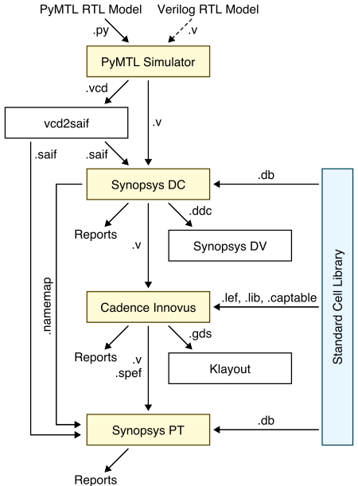

ECE 5745 Tutorial 6: Automated ASIC Flow
==========================================================================

 - Author: Christopher Batten
 - Date: February 1, 2017

**Table of Contents**

 - Introduction
 - PyMTL-Based Testing, Simulation, Translation
 - Using Synopsys Design Compiler for Synthesis
 - Using Synopsys IC Compiler for Place-and-Route
 - Using Synopsys PrimeTime for Power Analysis
 - Using Verilog RTL Models
 - Using the Automated ASIC Flow for Design-Space Exploration
 - Pushing GCD Unit Through the Automated ASIC Flow

Introduction
--------------------------------------------------------------------------

The previous tutorial introduced students to the key tools used for
synthesis, place-and-route, and power analysis, but the previous tutorial
required students to enter commands manually for each tool. This is
obviously very tedious and error prone. An agile hardware design flow
demands automation to simplify rapidly exploring the area, energy, timing
design space of one or more designs. Luckily, Synopsys tools can be
easily scripted using TCL, and even better, the ECE 5745 staff have
already created these TCL scripts along with a set of Makefiles to run
thee TCL scripts. The ECE 5745 TCL scripts were based on the Synopsys
reference methodology which is copyrighted by Synopsys. This means you
_cannot_ take this repo and/or the scripts and make them public. Please
keep this in mind.

The tutorial will describe how these scripts can make it relatively easy
to take designs from RTL to layout. We often call such a set of scripts
an "ASIC flow". However, it is critical for students to avoid thinking of
the ASIC flow as a black box. As in all engineering, garbage-in means
garbage-out. If you are not careful it is all to easy to use the ASIC
flow to analyze a completely invalid design. This tutorial assumes you
have already completed the tutorials on Linux, Git, PyMTL, Verilog, and
the Synopsys ASIC tools.

The following diagram illustrates the four primary tools we will be using
in ECE 5745. Notice that this toolflow diagram is higher level than the
one we used in the previous tutorial. This is because the ASIC flow
actually uses several additional other files, but at the same time, we
are less concerned about the details of every single step since we are
using automating the entire process. We can hopefully focus more on the
big picture of how the tools fit together at a high-level.



 1. We use the PyMTL framework to test, verify, and evaluate the
    execution time (in cycles) of our design. This part of the flow is
    exactly the same as ECE 4750. Note that we can write our RTL models
    in either PyMTL or Verilog. Once we are sure our design is working
    correctly, we can then start to push the design through the flow. The
    ASIC flow requires Verilog RTL as an input, so we can use PyMTL's
    automatic translation tool to translate PyMTL RTL models into Verilog
    RTL.

 2. We use Synopsys Design Compiler (DC) to synthesize our design, which
    means to transform the Verilog RTL model into a Verilog gate-level
    netlist where all of the gates are selected from a standard cell
    library. We need to provide Synopsys DC with higher-level
    characterization information about our standard cell library.

 3. We use Synopsys IC Compiler (ICC) to place-and-route our design,
    which means to place all of the gates in the gate-level netlist into
    rows on the chip and then to generate the metal wires that connect
    all of the gates together. Synopsys ICC will also handle power and
    clock routing. We need to provide Synopsys ICC with lower-level
    characterization information about our standard cell library.
    Synopsys ICC also generates reports that can be used to more
    accurately characterize area and timing.

 4. We use Synopsys PrimeTime (PT) to perform power-analysis of our
    design. This requires switching activity information for every net in
    the design (which comes from the PyMTL simulator) and parasitic
    capacitance information for every net in the design (which comes from
    Synopsys ICC). Synopsys PT puts the switching activity, capacitance,
    clock frequency, and voltage together to estimate the power
    consumption of every net and thus every module in the design.

Extensive documentation is provided by Synopsys for Design Compiler, IC
Compiler, and PrimeTime. We have organized this documentation and made it
available to you on the [public course
webpage](http://www.csl.cornell.edu/courses/ece5745/syndocs). The
username/password was distributed during lecture.

The first step is to source the setup script, clone this repository from
GitHub, and define an environment variable to keep track of the top
directory for the project.

```
 % source setup-ece5745.sh
 % mkdir $HOME/ece5745
 % cd $HOME/ece5745
 % git clone git@github.com:cornell-ece5745/ece5745-tut6-asic-flow
 % cd ece5745-tut6-asic-flow
 % TOPDIR=$PWD
```

PyMTL-Based Testing, Simulation, Translation
--------------------------------------------------------------------------

As in the previous tutorial, our goal is to characterize the area,
energy, and timing for the sort unit from the PyMTL tutorial using the
ASIC tools. As a reminder, the sort unit takes as input four integers and
a valid bit and outputs those same four integers in increasing order with
the valid bit. The sort unit is implemented using a three-stage
pipelined, bitonic sorting network and the datapath is shown below.


Let's start by running the tests for the sort unit and note that the
tests for the `SortUnitStructRTL` will fail. You can just copy over your
implementation of the `MinMaxUnit` from when you completed the PyMTL
tutorial. If you have not completed the PyMTL tutorial then go back and
do that now.

```
 % mkdir $TOPDIR/sim/build
 % cd $TOPDIR/sim/build
 % py.test ../tut3_pymtl/sort
 % py.test ../tut3_pymtl/sort --test-verilog
```

As we learned in the previous tutorial, the `--test-verilog` command line
option tells the PyMTL framework to first translate the sort unit into
Verilog, and then important it back into PyMTL to verify that the
translated Verilog is itself correct.

Let's experiment with an example which is valid PyMTL code, but does is
not translatable to illustrate the importance of testing with
`--test-verilog`. Instead of using an `if` statement to implement the
`MinMaxUnit`, maybe we want to be clever and use the built-in `min` and
`max` Python functions like this:

```python
#=========================================================================
# MinMaxUnit
#=========================================================================
# This module takes two inputs, compares them, and outputs the larger
# via the "max" output port and the smaller via the "min" output port.

from pymtl import *

class MinMaxUnit( Model ):

  def __init__( s, nbits=8 ):

    s.in0     = InPort  ( nbits )
    s.in1     = InPort  ( nbits )
    s.out_min = OutPort ( nbits )
    s.out_max = OutPort ( nbits )

    @s.combinational
    def block():
      s.out_max.value = max( s.in0, s.in1 )
      s.out_min.value = min( s.in0, s.in1 )
```

Rerun the tests on the pure-PyMTL implementation:

```
 % cd $TOPDIR/sim/build
 % py.test ../tut3_pymtl/sort
```

All of the tests should pass, but now try running the tests with
`--test-verilog`.

```
 % cd $TOPDIR/sim/build
 % py.test ../tut3_pymtl/sort --test-verilog
 % py.test ../tut3_pymtl/sort -x --tb=short --test-verilog
E   VerilogTranslationError:
E   Encountered a non-translatable function call: max!
E
E   >       s.out_max.value = max( s.in0, s.in1 )
E
E   File:      ../tut3_pymtl/sort/MinMaxUnit.py
E   Model:     MinMaxUnit_0x1dad3b300509acd
E   Function:  block
E   Line:      28
```

The error message indicates that there is a translation error. In other
words, using the `min`/`max` functions is perfectly valid PyMTL code, but
the translation tool does not know how to translate these constructs into
Verilog. If you stick to the PyMTL usage rules posted on the course
website, your code will _probably_ be translatable. However, it is not
that difficult to write reasonable PyMTL code that is not translatable,
_and_ there is no guarantee the translation tool will catch translation
errors and produce such a nice error message as shown above. Translation
errors can result in run-time errors when you use `--test-verilog` or
they can even simulate correctly but produce errors when you try and
synthesize the design. So remember to always use `--test-verilog` before
using the ASIC flow, and to look for errors from the translation tool,
Verilator, and/or Synopsys DC.

After running the tests we use the sort unit simulator to do the final
translation into Verilog and to dump the `.vcd` (Value Change Dump) file
that we want to use for power analysis.

```
 % cd $TOPDIR/sim/build
 % ../tut3_pymtl/sort/sort-sim --impl rtl-struct --stats --translate --dump-vcd
 num_cycles          = 105
 num_cycles_per_sort = 1.05
```

We now have both the translated Verilog for the sort unit, and the `.vcd`
file for a specific simulation, so we are ready to use the ASIC flow to
quantitatively evaluate the area, energy, and timing.

Using Synopsys Design Compiler for Synthesis
--------------------------------------------------------------------------

All scripts for the ASIC flow are contained within the `asic`
subdirectory. We will use `make` to drive the ASIC flow, and a special
`Makefrag` describes the details of the specific design you want to push
through the flow. Go into the `asic` subdirectory and take a look at the
`Makefrag`.

```
 % cd $TOPDIR/asic
 % more Makefrag
```

The `Makefrag` has one entry for each design. Each entry looks like this:

```
 ifeq ($(design),sort-unit)
   clock_period  = 1.0
   vsrc          = SortUnitStructRTL_0x73ab8da9cdd886de.v
   vcd           = sort-rtl-struct-random.verilator1.vcd
 endif
```

Every design has a name and in this case the design name is `sort-unit`.
The `clock_period` variable is where you set the target clock period
constraint for this design. The `vsrc` variable is the name of the
Verilog file you want to push through the flow. The `vcd` variable is the
name of the VCD file you want to use for power analysis.

We set the following line in the `Makefrag` to choose which design we
want to push through the flow:

```
 % cd $TOPDIR/asic
 % grep "design =" Makefrag
 design = sort-unit
```

Make sure this set to 'sort-unit' so we are pushing the correct design
through the flow. Now all we need to do use `make` like this:

```
 % cd $TOPDIR/asic/dc-syn
 % make
```

You will see `make` run some commands, start Synopsys DC, run some TCL
scripts, and then finish up. Essentially, the automated system is doing
something very similar to what we did in the previous tutorial, although
it is using many more commands with much more aggressive options to
achieve higher quality of results (QOR).

The first thing to do after you finish synthesis for a new design is to
_look at the log file_! We cannot stress how importance this is. Synopsys
DC will often exit with an error or worse simply produce some warnings
which are actually catastrophic. If you just blindly use `make` and then
move on to Synopsys ICC there is a good chance you will be pushing a
completely broken design through the flow. There are many, many things
that can go wrong. You may have used the incorrect file/module names in
the `Makefrag`, there might be code in your Verilog RTL that is not
synthesizable, or you might have a simulation/synthesis mismatch such
that the design you are pushing through the flow is not really what you
were simulating. This is not easy and there is no simple way to figure
out these issues, but you must start by looking for errors and warnings
in the log file like this:

```
 % cd $TOPDIR/asic/dc-syn
 % grep Error current-dc/log/dc.log
 % grep Warning current-dc/log/dc.log
```

There should be no errors, but there will usually be warnings. The hard
part is knowing which warnings you can ignore and which ones indicate
something more problematic. If you are using PyMTL, you will see many
warnings like this:

```
Warning: In design 'MinMaxUnit_4', port 'clk[0]' is not connected to any nets. (LINT-28)
Warning: In design 'MinMaxUnit_4', port 'reset[0]' is not connected to any nets. (LINT-28)
Warning: In design 'MinMaxUnit_0', port 'clk[0]' is not connected to any nets. (LINT-28)
Warning: In design 'MinMaxUnit_0', port 'reset[0]' is not connected to any nets. (LINT-28)
Warning: In design 'MinMaxUnit_1', port 'clk[0]' is not connected to any nets. (LINT-28)
```

This is because PyMTL always adds a `clk` and `reset` port to every
module regardless of whether or not that module actually uses these
ports. You can safely ignore these warnings.

Regardless of which RTL language you are using, you might see warnings
like this:

```
Warning: In design 'SortUnitStructRTL', a pin on submodule 'minmax1_S1' is connected to logic 1 or logic 0. (LINT-32)
Warning: In design 'SortUnitStructRTL', a pin on submodule 'minmax0_S2' is connected to logic 1 or logic 0. (LINT-32)
Warning: In design 'SortUnitStructRTL', a pin on submodule 'minmax0_S1' is connected to logic 1 or logic 0. (LINT-32)
Warning: In design 'SortUnitStructRTL', a pin on submodule 'elm_S1S2$000' is connected to logic 1 or logic 0. (LINT-32)
Warning: In design 'SortUnitStructRTL', a pin on submodule 'elm_S1S2$001' is connected to logic 1 or logic 0. (LINT-
```

I am not quite clear why these are a problem, so you can safely ignore
these warnings. If you see errors or warnings related to unresolved
module instances or unconnected nets, then you need to dig in and fix
them. Again, there are no easy rules here. You must build your intuition
into which warnings are safe to ignore.

When the synthesis is completed you can take a look at the resulting
Verilog gate-level netlist here:

```
 % cd $TOPDIR/asic/dc-syn
 % more current-dc/results/SortUnitStructRTL_0x73ab8da9cdd886de.mapped.v
```

The automated system is also setup to output a bunch of reports. However,
as discussed in the previous tutorial, we usually don't use these reports
since the post-synthesis area, energy, and timing results can be
significantly different than the more accurate post-place-and-route
results.

However, there is a "resources" report that can be somewhat useful. You
can view the resources report like this:

```
 % cd $TOPDIR/asic/current-dc
 % more reports/SortUnitStructRTL_0x73ab8da9cdd886de.mapped.resources.rpt

 ****************************************
 Design : MinMaxUnit_0x152ab97dfd22b898_3
 ****************************************

 Resource Report for this hierarchy in file
   ../../../sim/build/SortUnitStructRTL_0x73ab8da9cdd886de.v

 =============================================================================
 | Cell           | Module         | Parameters | Contained Operations       |
 =============================================================================
 | gte_x_1        | DW_cmp         | width=8    | gte_264 (SortUnitStructRTL_0x73ab8da9cdd886de.v:264) |
 =============================================================================

 Implementation Report
 ===============================================================================
 |                    |                  | Current            | Set            |
 | Cell               | Module           | Implementation     | Implementation |
 ===============================================================================
 | gte_x_1            | DW_cmp           | apparch (area)     |                |
 ===============================================================================
```

When using the more sophisticated `compile_ultra` command, Synopsys DC
can recognize common arithmetic operators and instead of treating those
operators as generic boolean logic, Synopsys DC will swap in what are
called "DesignWare" components. These DesignWare components are
pre-optimized at the gate-level for a generic gate-level library, which
then is eventually mapped to the specific standard-cell library used for
synthesis. There are DesignWare components for adders, shifters,
multipliers, floating-point units, etc. You can read more about the
DesignWare comments in the Synopsys documentation on the [public course
webpage](http://www.csl.cornell.edu/courses/ece5745/syndocs).

The resources report tells you what DesignWare components Synopsys DC has
automatically inferred. As an aside, if you want to use more complicated
components (e.g., a floating point unit) then Synopsys DC cannot infer
these components automatically; you need to explicitly instantiate these
components in your Verilog. From the report we can see that Synopsys DC
has inferred a `DW_cmp` component. You can learn more about this
component from the
[datasheet](http://www.csl.cornell.edu/courses/ece5745/syndocs/dwbb_datasheets/dw01_cmp6.pdf).

The data sheet mentions that it has several possible arithmetic
implementations it can choose from to meet the specific area, energy,
timing constraints. It has a ripple-carry implementation, a
delay-optimized parallel-prefix implementation, and an area-optimized
implementation. DesignWare components can significantly improve the area,
energy, and timing of arithmetic circuits.

Using Synopsys IC Compiler for Place-and-Route
--------------------------------------------------------------------------

We use Synopsys IC Compiler (ICC) for placing and routing standard cells,
but also for power routing and clock tree synthesis. The Verilog
gate-level netlist generated by Synopsys DC has no physical information:
it is just a netlist, so the Synopsys IC will first try and do a rough
placement of all of the gates into rows on the chip. Synopsys IC will
then do some preliminary routing, and iterate between more and more
detailed placement and routing until it reaches the target cycle time (or
gives up). Synopsys IC will also route all of the power and ground rails
in a grid and connect this grid to the power and ground pins of each
standard cell, and Synopsys IC will automatically generate a clock tree
to distribute the clock to all sequential state elements with hopefully
low skew. The automated flow for place-and-route is much more
sophisticated compared to what we did in the previous tutorial.

We can use `make` to run Synopsys ICC like this:

```
 % cd $TOPDIR/asic/icc-par
 % make
```

Place-and-route can take significantly longer than synthesis, so be
prepared to wait a while with larger designs. If you look at the output
scrolling by you will see some of the optimization passes as Synopsys ICC
attempts to iteratively improve the design. As with Synopsys DC, you can
search the logs to look for errors and/or warnings.

```
 % cd $TOPDIR/asic/icc-par
 % grep Error current-icc/log/*.log
 % grep Warning current-icc/log/*.log
```

However, usually we catch errors in Synopsys DC and after that we are all
set. So if you see errors in Synopsys ICC, you might want to go back and
see if there were any errors in Synopsys DC.

The automated system is also setup to output a bunch of reports in the
`current-icc/reports` directory. You might want to start with the
quality-of-results (QOR) report. If you take a look that report you will
see something like this:

```
 % cd $TOPDIR/asic/icc-par
 % more current-icc/reports/chip_finish_icc.qor.rpt
 ...
  Timing Path Group 'REGIN'
  -----------------------------------
  Levels of Logic:               1.00
  Critical Path Length:          0.47
  Critical Path Slack:           0.61
  Critical Path Clk Period:      1.00
  Total Negative Slack:          0.00
  No. of Violating Paths:        0.00
  Worst Hold Violation:          0.00
  Total Hold Violation:          0.00
  No. of Hold Violations:        0.00
  -----------------------------------

  Timing Path Group 'REGOUT'
  -----------------------------------
  Levels of Logic:               9.00
  Critical Path Length:          0.85
  Critical Path Slack:           0.02
  Critical Path Clk Period:      1.00
  Total Negative Slack:          0.00
  No. of Violating Paths:        0.00
  Worst Hold Violation:          0.00
  Total Hold Violation:          0.00
  No. of Hold Violations:        0.00
  -----------------------------------

  Timing Path Group 'ideal_clock1'
  -----------------------------------
  Levels of Logic:               9.00
  Critical Path Length:          0.91
  Critical Path Slack:           0.03
  Critical Path Clk Period:      1.00
  Total Negative Slack:          0.00
  No. of Violating Paths:        0.00
  Worst Hold Violation:          0.00
  Total Hold Violation:          0.00
  No. of Hold Violations:        0.00
  -----------------------------------
```

Paths are organized into four groups: REGIN, REGOUT, INOUT, and CLK path
groups. REGIN paths start at an input port and end at a register; REGOUT
paths start at a register and end at an output port; INOUT paths start at
an input port and end at an output port; and CLK paths start at a
register and end at register. The following diagram is from Chapter 1 of
the [Synopsys Timing Constraints and Optimization User
Guide](http://www.csl.cornell.edu/courses/ece5745/syndocs/tcoug.pdf).


We have setup the flow so that the tools have to fit all four of these
paths in a single cycle. The QOR report shows the worst path within each
path group. The overall critical path for your design will be the worse
critical path across all four groups, and the actual cycle time is
calculated as the "Critical Path Clk Period" (this is the target clock
constraint) minus the "Critical Path Slack". This is very important! The
"Critical Path Clk Period" is really just the clock constraint we
specified in the `Makefrag`. If we have negative slack then the design
must run slower than this clock constraint, and if we have positive slack
then the design can run faster than this clock constraint. Again, the
actual cycle time is the calculated by subtracting the "Critical Path
Slack" from the "Critical Path Clk Period" (and we must look across all
four path groups to find the overall critical path). So in this example
the REGOUT path group has the worst cycle time of 0.98ns.

To figure out the actual critical path through the design you will need
to look in the timing report. The timing report is organized by path
group, with the worst case path first in each path group. This means you
cannot just look at the first path in the timing report! The critical
path might be in a different path group which is later in the file. So
first, use the QOR report to figure out which path group contains the
critical path, and then search for that path group in the timing report
like this:

```
 % cd $TOPDIR/asic/icc-par
 % less -p "Path Group: REGOUT" current-icc/reports/chip_finish_icc.timing.rpt
 ...
 Point                                     Fanout  Cap      Trans   Incr    Path
  ----------------------------------------------------------------------------------
  clock ideal_clock1 (rise edge)                                    0.0000  0.0000
  clock network delay (propagated)                                  0.1243  0.1243
  elm_S2S3_001/out_reg_1_/CLK (DFFX1)                       0.0709  0.0000  0.1243 r
  elm_S2S3_001/out_reg_1_/Q (DFFX1)                         0.0585  0.1915  0.3158 r
  elm_S2S3_001/out[1] (net)                     4  12.0537          0.0000  0.3158 r
  elm_S2S3_001/out[1] (Reg_2)                                       0.0000  0.3158 r
  elm_S2S3_001_out[1] (net)                        12.0537          0.0000  0.3158 r
  minmax_S3/in0[1] (MinMaxUnit_0)                                   0.0000  0.3158 r
  minmax_S3/in0[1] (net)                           12.0537          0.0000  0.3158 r
  minmax_S3/U21/IN2 (NOR2X0)                                0.0585  0.0000  0.3158 r
  minmax_S3/U21/QN (NOR2X0)                                 0.0556  0.0451  0.3610 f
  minmax_S3/n8 (net)                            1   3.4959          0.0000  0.3610 f
  minmax_S3/U24/IN2 (OA22X1)                                0.0556  0.0000  0.3610 f
  minmax_S3/U24/Q (OA22X1)                                  0.0333  0.0720  0.4330 f
  minmax_S3/n9 (net)                            1   3.1170          0.0000  0.4330 f
  minmax_S3/U25/IN4 (OA22X1)                                0.0333  0.0000  0.4330 f
  minmax_S3/U25/Q (OA22X1)                                  0.0336  0.0646  0.4976 f
  minmax_S3/n12 (net)                           1   3.1545          0.0000  0.4976 f
  minmax_S3/U26/IN4 (OA22X1)                                0.0336  0.0006  0.4982 f
  minmax_S3/U26/Q (OA22X1)                                  0.0339  0.0648  0.5630 f
  minmax_S3/n15 (net)                           1   3.2353          0.0000  0.5630 f
  minmax_S3/U27/IN4 (OA22X1)                                0.0339  0.0000  0.5630 f
  minmax_S3/U27/Q (OA22X1)                                  0.0342  0.0651  0.6282 f
  minmax_S3/n18 (net)                           1   3.3477          0.0000  0.6282 f
  minmax_S3/U28/IN4 (OA22X1)                                0.0342  0.0016  0.6298 f
  minmax_S3/U28/Q (OA22X1)                                  0.0326  0.0639  0.6937 f
  minmax_S3/n21 (net)                           1   2.7705          0.0000  0.6937 f
  minmax_S3/U29/IN4 (OA22X1)                                0.0326  0.0000  0.6938 f
  minmax_S3/U29/Q (OA22X1)                                  0.0487  0.0761  0.7699 f
  minmax_S3/n24 (net)                           3   8.5508          0.0000  0.7699 f
  minmax_S3/U30/IN4 (OA22X1)                                0.0487  0.0016  0.7714 f
  minmax_S3/U30/Q (OA22X1)                                  0.0808  0.1001  0.8716 f
  minmax_S3/n27 (net)                           4  20.3233          0.0000  0.8716 f
  minmax_S3/U40/S (MUX21X1)                                 0.0808  0.0003  0.8718 f
  minmax_S3/U40/Q (MUX21X1)                                 0.0701  0.0989  0.9708 r
  minmax_S3/out_max[2] (net)                    1  14.9609          0.0000  0.9708 r
  minmax_S3/out_max[2] (MinMaxUnit_0)                               0.0000  0.9708 r
  out_002[2] (net)                                 14.9609          0.0000  0.9708 r
  out_002[2] (out)                                          0.0701  0.0064  0.9771 r
  data arrival time                                                         0.9771

  clock ideal_clock1 (rise edge)                                    1.0000  1.0000
  clock network delay (ideal)                                       0.0000  1.0000
  clock reconvergence pessimism                                     0.0000  1.0000
  output external delay                                             0.0000  1.0000
  data required time                                                        1.0000
  ----------------------------------------------------------------------------------
  data required time                                                        1.0000
  data arrival time                                                        -0.9771
  ----------------------------------------------------------------------------------
  slack (MET)                                                               0.0229
```

This report is similar to the timing reports you saw in the previous
tutorial. Note that we can now see the clock network delay factored into
the beginning of the path. For paths that start at a register and end at
a register within the same design, we will see the clock network delay
factoted both at the beginning and end of the path. If these delays are
not equal we will have either positive or negative clock skew. The path
shown above is not between two registers, but is instead from a register
within the design to the output port. We have setup the tools so that
these paths must also be completed within one cycle. Note that there is
no clock network delay at the end of this path, because the end point is
an output port not a register. This might seem to penalize these REGOUT
paths, but keep in mind that there will be a register in the _next_
module which will have some setup time. So we will still end up with a
reasonable estimate even for REGOUT paths. The fanout and parasitic
capacitance on each net is also shown which can be useful in identifying
nets with unusually high loads. This critical path is similar but not
exactly the same as we saw in the previous tutorial. This is because the
ASIC flow uses more commands with different options than what we did
manually. Note that if the path group containg the critical path was
`ideal_clock1` then you would search for `Path Group: ideal_clock1`
instead.

You can view the area report like this:

```
 % cd $TOPDIR/asic/icc-par
 % more current-icc/reports/chip_finish_icc.area.rpt
 ...
 Combinational area:               2421.043251
 Buf/Inv area:                      972.288013
 Noncombinational area:            2463.436769
 Macro/Black Box area:                0.000000
 Net Interconnect area:             199.315271

 Total cell area:                  4884.480021
 Total area:                       5083.795291

                    Global      Local
                    Cell Area   Cell Area
                    ----------  ------------------
 Hierarchical cell  Abs                Non    Black-
                    Total  %    Comb   Comb   boxes
 ------------------ ------ ---- ------ ------ ----  -------------------------------
 SortUnitStructRTL  4884.4  100  546.5    0.0  0.0  SortUnitStructRTL
 elm_S0S1_000        199.0  4.1    0.0  199.0  0.0  Reg_0x45f1552f10c5f05d_7
 elm_S0S1_001        199.0  4.1    0.0  199.0  0.0  Reg_0x45f1552f10c5f05d_6
 elm_S0S1_002        199.0  4.1    0.0  199.0  0.0  Reg_0x45f1552f10c5f05d_5
 elm_S0S1_003        199.0  4.1    0.0  199.0  0.0  Reg_0x45f1552f10c5f05d_4
 elm_S1S2_000        199.0  4.1    0.0  199.0  0.0  Reg_0x45f1552f10c5f05d_11
 elm_S1S2_001        199.0  4.1    0.0  199.0  0.0  Reg_0x45f1552f10c5f05d_10
 elm_S1S2_002        199.0  4.1    0.0  199.0  0.0  Reg_0x45f1552f10c5f05d_9
 elm_S1S2_003        199.0  4.1    0.0  199.0  0.0  Reg_0x45f1552f10c5f05d_8
 elm_S2S3_000        199.0  4.1    0.0  199.0  0.0  Reg_0x45f1552f10c5f05d_3
 elm_S2S3_001        199.0  4.1    0.0  199.0  0.0  Reg_0x45f1552f10c5f05d_2
 elm_S2S3_002        199.0  4.1    0.0  199.0  0.0  Reg_0x45f1552f10c5f05d_1
 elm_S2S3_003        199.0  4.1    0.0  199.0  0.0  Reg_0x45f1552f10c5f05d_0
 minmax0_S1          364.9  7.5  364.9    0.0  0.0  MinMaxUnit_0x152ab97dfd22b898_2
 minmax0_S2          364.9  7.5  364.9    0.0  0.0  MinMaxUnit_0x152ab97dfd22b898_3
 minmax1_S1          364.9  7.5  364.9    0.0  0.0  MinMaxUnit_0x152ab97dfd22b898_4
 minmax1_S2          364.9  7.5  364.9    0.0  0.0  MinMaxUnit_0x152ab97dfd22b898_1
 minmax_S3           387.0  7.9  387.0    0.0  0.0  MinMaxUnit_0x152ab97dfd22b898_0
 val_S0S1             41.4  0.8   16.5   24.8  0.0  RegRst_0x2ce052f8c32c5c39_0
 val_S1S2             30.4  0.6    5.5   24.8  0.0  RegRst_0x2ce052f8c32c5c39_1
 val_S2S3             30.4  0.6    5.5   24.8  0.0  RegRst_0x2ce052f8c32c5c39_2
 ------------------ ------ ---- ------ ------ ----  -------------------------------
 Total                          2421.0 2463.4  0.0
```

This report is similar to what we saw in the previous tutorial. Note that
the total cell area is different from the total area. The total cell area
includes just the standard cells, while the total area includes the "Net
Interconnect Area". To be totally honest, I am not quite sure what "Net
Interconnect Area" actually means, but we use the total area in our
analysis. Again these numbers are not identical to the previous tutorial,
since the ASIC flow uses more commands with different options than what
we did manually.

We have written a little script to parse the reports and generate a
`summary.txt` file. This script takes care of looking across all four
path groups to fine the true cycle time that you should use in your
analysis.

```
 % cd $TOPDIR/asic/icc-par
 % cat current-icc/reports/summary.txt

  vsrc       = SortUnitStructRTL_0x73ab8da9cdd886de.v
  area       = 5084 # um^2
  constraint = 1.0 # ns
  slack      = 0.02 # ns
  cycle_time = 0.98 # ns
```

While we do not use GUIs to drive our flow, we often use GUIs to analyze
the results. You can start the Synopsys ICC GUI to visualize the final
layout like this:

```
 % cd $TOPDIR/asic/icc-par/current-icc
 % icc_shell -gui
```

Once the GUI has finished loading you will viewing a "MainWindow", use
the following steps to actually open up the most recently
placed-and-routed design in a "LayoutWindow":

 - Enter `source icc_setup.tcl` at `icc_shell>` prompt
 - Chose _File > Open Design..._ from the menu
 - Click the folder button to right of _Library Name_
 - Select the orange folder with L in file browser
 - Select _chip_finish_icc_ in list
 - Click `Okay`

As mentioned in the previous tutorial, we call the resulting plot an
"amoeba plot" because the tool often generates blocks that look like
amoebas. You can zoom in to see how the standard cells were placed and
how the routing was done. You can turn on an off the visibility of metal
layers using the panel on the left. You can choose a better color scheme
by choose the `ece5745` preset. One very useful feature is to view the
hierarchy and area breakdown. This will be critical for producing
high-quality amoeba plots. You can use the following steps to highlight
various modules on the amoeba plot:

 - Choose `Placement > Color By Hierarchy` from the menu
 - Click `Reload` in the sidebar
 - Select `Color hierarchical cells at level` in the pop-up window
 - Click `OK` in the pop up
 - Click checkmark and apply to show just one component

You can also choose _Color Specific Hierarchical Cells" to select various
modules at different levels of the hierarchy to highlight. Another very
useful feature is to highlight the critical path on the amoeba plot using
the following steps:

 - Choose `Timing > New Timing Analysis Window` from the menu
 - Focus on `Select Paths` window, click `OK`
 - List of paths should appear
 - Click on path to see it highlighted in the layout view

You can see an example amoeba plot below. Note that you will need to use
some kind of "screen-capture" software to capture the plot and by default
it will have a black background. We strongly recommend inverting the
colors so that the amoeba plot you include in your reports is dark on
white (instead of white on dark). This makes the chip plot easier to
read. You will also need to play with the colors to enable easily seeing
the various parts of your design. In this example, we have chosen to
highlight the five `MinMaxUnits` (brown, blue, green, red, gray) and one
of the critical paths which goes through the red `MinMaxUnit`. Note how
the tool has actually spread the red `MinMaxUnit` a part a bit. Keep in
mind that these tools use incredibly sophisticated heuristics and so it
can sometimes be difficult to understand every detail about why it places
cells in specific places.


Using Synopsys PrimeTime for Power Analysis
--------------------------------------------------------------------------

We use Synopsys PrimeTime (PT) for power analysis. As described in the
previous tutorial, we are using an advanced form of power analysis which
combines activity factors from RTL simulation with the detailed
gate-level model. We can use `make` to run Synopsys PT like this:

```
 % cd $TOPDIR/asic/pt-pwr
 % make

  vsrc       = SortUnitStructRTL_0x73ab8da9cdd886de.v
  input      = sort-rtl-struct-random
  area       = 5084 # um^2
  constraint = 1.0 # ns
  slack      = 0.02 # ns
  cycle_time = 0.98 # ns
  exec_time  = 104 # cycles
  power      = 6.424 # mW
  energy     = 0.65473408 # nJ
```

We have setup the flow to display the final summary information after
this step. You can also display it directly like this:

```
 % cd $TOPDIR/asic/pt-pwr
 % cat current-pt/reports/summary.txt
```

You can see the total area, cycle time, power, and energy for your design
when running the given input (i.e., when using the VCD file specified in
the `Makefrag`). You can see an overview of the power consumption here:

```
 % cd $TOPDIR/asic/pt-pwr
 % more current-pt/reports/pt-pwr.report
 ...
                Internal Switching  Leakage Total
 Power Group       Power     Power    Power Power   (     %)
 -----------------------------------------------------------
 clock_network   3.4e-03   4.6e-04  1.0e-06 3.8e-03 (60.20%)  i
 register       -3.3e-05   3.9e-04  1.3e-05 3.7e-04 ( 5.80%)
 combinational   1.6e-03   5.2e-04  1.3e-05 2.1e-03 (33.99%)
 sequential      0.0       0.0      0.0     0.0     ( 0.00%)
 memory          0.0       0.0      0.0     0.0     ( 0.00%)
 io_pad          0.0       0.0      0.0     0.0     ( 0.00%)
 black_box       0.0       0.0      0.0     0.0     ( 0.00%)

  Net Switching Power  = 1.380e-03   (21.47%)
  Cell Internal Power  = 5.017e-03   (78.10%)
  Cell Leakage Power   = 2.768e-05   ( 0.43%)
                         ---------
  Total Power          = 6.424e-03  (100.00%)
```

The sort unit consumes ~6mW of power when processing random input data.
This is in the same ballpark as we saw in the previous tutorial. These
numbers are not identical to the previous tutorial, since the ASIC flow
uses more commands with different options than what we did manually.
Power is the rate change of energy (i.e., energy divided by execution
time), so the total energy is just the product of the total power, the
number of cycles, and the cycle time. When we ran the sort unit simulator
at the beginning of the tutorial, we saw that the simulation required 105
cycles. Note that the summary from Synopsys PT reports 104 cycles. This
small discrepancy is just due to accounting (i.e., Synosys PT tries to
figure out the total number of cycles from the `.saif` file so sometimes
it is off by one). The cycle time is 0.98ns, so the total energy is
104x0.98x6.424 = 654pJ. Since we are doing 100 sorts, this corresponds to
about 6.54pJ per sort.

You can see a more detailed power breakdown by module here:

```
 % cd $TOPDIR/asic/icc-par
 % more current-pt/reports/pt-pwr.power.avg.max.report

                            Int      Switch   Leak     Total
 Hierarchy                  Power    Power    Power    Power        %
 --------------------------------------------------------------------
 SortUnitStructRTL          5.02e-03 1.38e-03 2.77e-05 6.42e-03 100.0
  elm_S2S3_000 (Reg_3)      2.28e-04 1.19e-05 1.05e-06 2.41e-04   3.7
  elm_S2S3_001 (Reg_2)      2.65e-04 3.56e-05 1.08e-06 3.02e-04   4.7
  elm_S2S3_002 (Reg_1)      2.68e-04 3.73e-05 1.08e-06 3.06e-04   4.8
  elm_S2S3_003 (Reg_0)      2.39e-04 9.27e-06 1.08e-06 2.50e-04   3.9
  elm_S1S2_000 (Reg_11)     2.65e-04 4.11e-05 1.07e-06 3.07e-04   4.8
  elm_S1S2_001 (Reg_10)     2.69e-04 3.56e-05 1.08e-06 3.06e-04   4.8
  elm_S1S2_002 (Reg_9)      2.57e-04 3.68e-05 1.06e-06 2.94e-04   4.6
  elm_S1S2_003 (Reg_8)      2.66e-04 3.46e-05 1.08e-06 3.01e-04   4.7
  elm_S0S1_000 (Reg_7)      2.73e-04 3.69e-05 1.08e-06 3.11e-04   4.8
  elm_S0S1_001 (Reg_6)      2.70e-04 3.66e-05 1.08e-06 3.08e-04   4.8
  elm_S0S1_002 (Reg_5)      2.71e-04 4.27e-05 1.08e-06 3.15e-04   4.9
  val_S2S3 (RegRst_2)       5.61e-05 1.13e-07 1.72e-07 5.64e-05   0.9
  elm_S0S1_003 (Reg_4)      2.65e-04 3.45e-05 1.07e-06 3.01e-04   4.7
  minmax_S3 (MinMaxUnit_0)  1.98e-04 1.27e-04 2.18e-06 3.27e-04   5.1
  minmax0_S1 (MinMaxUnit_2) 2.08e-04 8.67e-05 2.08e-06 2.97e-04   4.6
  minmax0_S2 (MinMaxUnit_3) 2.08e-04 9.08e-05 2.11e-06 3.00e-04   4.7
  minmax1_S1 (MinMaxUnit_4) 2.14e-04 9.09e-05 2.09e-06 3.07e-04   4.8
  minmax1_S2 (MinMaxUnit_1) 1.96e-04 8.64e-05 2.07e-06 2.85e-04   4.4
  val_S0S1 (RegRst_0)       3.34e-05 2.70e-07 2.12e-07 3.39e-05   0.5
  val_S1S2 (RegRst_1)       2.22e-05 1.00e-07 1.48e-07 2.24e-05   0.3
```

These results are similar to what we saw in the previous tutorial.

Using Verilog RTL Models
--------------------------------------------------------------------------

Students are welcome to use Verilog instead of PyMTL to design their RTL
models. Having said this, we will still exclusively use PyMTL for all
test harnesses, FL/CL models, and simulation drivers. This really
simplifies managing the course, and PyMTL is actually a very productive
way to test/evaluate your Verilog RTL designs. We use PyMTL's Verilog
import feature described in the Verilog tutorial to make all of this
work. The following commands will run all of the tests on the _Verilog_
implementation of the sort unit.

```
 % cd $TOPDIR/sim/build
 % rm -rf *
 % py.test ../tut4_verilog/sort
```

As before, the tests for the SortUnitStructRTL will fail. You can just
copy over your implementation of the MinMaxUnit from when you completed
the Verilog tutorial. If you have not completed the Verilog tutorial then
go back and do that now. After running the tests we use the sort unit
simulator to translate the PyMTL RTL model into Verilog and to dump the
VCD file that we want to use for power analysis.

```
 % cd $TOPDIR/sim/build
 % ../tut4_verilog/sort/sort-sim --impl rtl-struct --translate --dump-vcd
```

Once you have tested your design and generated the single Verilog file
and the VCD file, you can push the design through the ASIC flow using the
exact same steps we used above.

Once you have tested your design and generated the single Verilog file
and the VCD file, you can push the design through the ASIC flow using the
exact same steps we used above.

```
 % cd $TOPDIR/asic/dc-syn  && make
 % cd $TOPDIR/asic/icc-par && make
 % cd $TOPDIR/asic/pt-pwr  && make

  vsrc       = SortUnitStructRTL_0x73ab8da9cdd886de.v
  input      = sort-rtl-struct-random
  area       = 5695 # um^2
  constraint = 1.0 # ns
  slack      = 0.0 # ns
  cycle_time = 1.0 # ns
  exec_time  = 104 # cycles
  power      = 6.423 # mW
  energy     = 0.667992 # nJ
```

Using the Automated ASIC Flow for Design-Space Exploration
--------------------------------------------------------------------------

One of the key benefits of using an automated ASIC flow, is that it
enables rapid design space exploration of different clock constraints,
input datasets, and design configurations. In this section, we will
briefly conduct three different experiments: (1) pushing the sort unit to
run at a faster clock frequency, (2) exploring the impact different input
datasets can have on power consumption, and (3) comparing the pipelined
sort unit to an unpipelined sort unit. This section will be working with
the PyMTL RTL implementation, so if you attempted to push the Verilog RTL
implementation in the previous section, we need to go back and regenerate
the Verilog from the PyMTL RTL implementation. Of course, you should also
feel free to try out these ideas using the Verilog RTL implementation.

```
 % cd $TOPDIR/sim/build
 % rm -rf *
 % ../tut3_pymtl/sort/sort-sim --impl rtl-struct --translate --dump-vcd
```

Recall that the sort unit had no problem meeting the 1ns clock
constraint. We usually want to push our designs until there is a couple
of percent negative slack (e.g., less than 5%) to ensure we are
accurately estimating the true peak performance of our design. So let's
push the sort unit through the flow again with a clock constraint of
0.95ns. You need to modify the `Makefrag` as follows:

```
 % cd $TOPDIR/asic
 % more Makefrag

 ifeq ($(design),sort-unit)
   clock_period  = 0.95
   vsrc          = SortUnitStructRTL_0x73ab8da9cdd886de.v
   vcd           = sort-rtl-struct-random.verilator1.vcd
 endif
```

Then simply use `make` to run each of the three steps again.

```
 % cd $TOPDIR/asic/dc-syn  && make
 % cd $TOPDIR/asic/icc-par && make
 % cd $TOPDIR/asic/pt-pwr  && make

  vsrc       = SortUnitStructRTL_0x73ab8da9cdd886de.v
  input      = sort-rtl-struct-random
  area       = 5133 # um^2
  constraint = 0.95 # ns
  slack      = 0.01 # ns
  cycle_time = 0.94 # ns
  exec_time  = 104 # cycles
  power      = 6.851 # mW
  energy     = 0.66975376 # nJ
```

Recall that earlier in the tutorial, we used a clock cycle constraint of
1ns and we had 0.02ns of positive slack. With a clock cycle constraint of
0.95ns we have 0.01ns of positive slack. This means the tools are still
meeting the clock constraint, but the positive slack is getting very
small meaning we are starting to approach the limit of how fast the sort
unit can run. The automated ASIC flow makes it relatively easy to
continue to push the design a bit. Here are the results for a variety of
different experiments with gradually decreasing clock constraints.

| clk (ns) | slack (ns) | ctime (ns) | area (um^2) | power (mW) |
|----------|------------|------------|-------------|------------|
| 1.00     |  0.02      | 0.98       | 5084        |  6.4       |
| 0.95     |  0.01      | 0.94       | 5133        |  6.8       |
| 0.90     |  0.01      | 0.91       | 5672        |  7.5       |
| 0.85     | -0.09      | 0.94       | 5681        |  7.4       |
| 0.80     | -0.01      | 0.81       | 5705        |  8.4       |
| 0.75     | -0.09      | 0.84       | 6054        |  8.5       |
| 0.70     | -0.06      | 0.76       | 5733        |  9.0       |
| 0.65     | -0.09      | 0.74       | 5653        |  9.2       |
| 0.60     | -0.10      | 0.70       | 6062        | 10.2       |
| 0.55     | -0.11      | 0.66       | 7190        | 12.0       |
| 0.50     | -0.14      | 0.64       | 7162        | 12.9       |
| 0.45     | -0.19      | 0.64       | 7164        | 12.9       |
| 0.20     | -0.43      | 0.63       | 6986        | 12.1       |

where `clk` is the clock constraint, and `ctime` is the cycle time. So we
can make a couple important observations. First, as we decrease the clock
constraint, the area and power generally increase. This is to be expected
since a more aggressive clock constraint requires the tools to use larger
cells and potentially more sophisticated logic implementations. In
addition, a more aggressive clock constraint results in a shorter cycle
time (higher clock frequency) which also increases the power. If we just
take these results on face value, then it appears the optimum cycle time
is approximately ~0.65ns. However, we can only achieve this cycle time by
pushing the tools with a clock cycle constraint less than 0.65ns. Notice
that with these lower clock constraints, the negative slack begins to
become a significant percentage of the clock constraint. We need to be
careful because if you push the tools too hard: (1) they can take forever
to finish, and (2) they can produce incorrect results. If the tools have
troubling placing and/or routing the design without causing very large
negative slack, they may just give up. I doubt the design produced with a
clock constraint of 0.2ns would actually work at all. In general, we
recommend shooting for about 10-20% negative slack. This should give very
reasonable results. You _definitely_ do not need to do so many
experiments. Just start with a reasonable clock cycle constraint, and
then maybe try another one or two constraints to find a reasonable
design. So for this example, we will choose a clock constraint of 0.55ns
since this achieves a good cycle time without too much negative slack.
Alternatively, if you are comparing multiple designs, sometimes the best
situation is to tune the baseline so it has a couple of percent of
negative slack and then ensure the alternative designs have similar cycle
times. This will enable a fair comparison since all designs will be
running at the same cycle time.

Note that the above data suggests the sort unit will consume ~12mW of
power when using a clock constraint of 0.55ns and processing random input
data. With a cycle time of 0.66ns, the total energy is 104x0.66x12 =
823pJ or 8.2pJ per sort. Let's do a quick experiment to compare the
energy for sorting a stream of all zeros to the energy for sorting a
stream of random values. We do _not_ need to re-synthesize and
re-place-and-route the design. We just need to generate a new VCD file
and re-run Synopsys PT. So first we re-run the sort unit simulator with a
different input:

```
 % cd $TOPDIR/sim/build
 % ../tut3_pymtl/sort/sort-sim --impl rtl-struct --input zeros --translate --dump-vcd
```

Now we need to change the entry in the `Makefrag` to point to the new VCD
file. The entry in the `Makefrag` should look like this:

```
 % cd $TOPDIR/asic
 % more Makefrag

 ifeq ($(design),sort-unit)
   clock_period  = 0.55
   vsrc          = SortUnitStructRTL_0x73ab8da9cdd886de.v
   vcd           = sort-rtl-struct-zeros.verilator1.vcd
 endif
```

Now we re-run Synopsys PT:

```
 % cd $TOPDIR/asic/pt-pwr && make

  vsrc       = SortUnitStructRTL_0x73ab8da9cdd886de.v
  input      = sort-rtl-struct-zeros
  area       = 7190 # um^2
  constraint = 0.55 # ns
  slack      = -0.11 # ns
  cycle_time = 0.66 # ns
  exec_time  = 104 # cycles
  power      = 4.018 # mW
  energy     = 0.27579552 # nJ
```

Not surprisingly, sorting a stream of zeros consumes significantly less
energy compared to sorting a stream of random values: 275pJ vs 823pJ. One
might ask why the sort unit consumes _any_ energy if it is just sorting a
stream of zeros. We can dig into the report to find the answer:

```
 % cd $TOPDIR/asic/icc-par
 % more current-pt/reports/pt-pwr.power.avg.max.report

                            Int      Switch   Leak     Total
Hierarchy                   Power    Power    Power    Power        %
---------------------------------------------------------------------
SortUnitStructRTL           2.19e-03 4.56e-04 2.75e-05 2.67e-03 100.0
  elm_S2S3_000 (Reg_3)      1.63e-04 0.000    8.88e-07 1.64e-04   6.1
  elm_S2S3_001 (Reg_2)      1.63e-04 0.000    8.88e-07 1.64e-04   6.1
  elm_S2S3_002 (Reg_1)      1.63e-04 0.000    8.88e-07 1.64e-04   6.1
  elm_S2S3_003 (Reg_0)      1.63e-04 0.000    8.88e-07 1.64e-04   6.1
  elm_S1S2_000 (Reg_11)     1.63e-04 0.000    8.88e-07 1.64e-04   6.1
  elm_S1S2_001 (Reg_10)     1.63e-04 0.000    8.88e-07 1.64e-04   6.1
  elm_S1S2_002 (Reg_9)      1.63e-04 0.000    8.88e-07 1.64e-04   6.1
  elm_S1S2_003 (Reg_8)      1.63e-04 0.000    8.88e-07 1.64e-04   6.1
  elm_S0S1_000 (Reg_7)      1.63e-04 0.000    8.88e-07 1.64e-04   6.1
  elm_S0S1_001 (Reg_6)      1.63e-04 0.000    8.88e-07 1.64e-04   6.1
  elm_S0S1_002 (Reg_5)      1.63e-04 0.000    8.88e-07 1.64e-04   6.1
  val_S2S3 (RegRst_2)       5.54e-05 1.26e-07 1.72e-07 5.57e-05   2.1
  elm_S0S1_003 (Reg_4)      1.63e-04 0.000    8.88e-07 1.64e-04   6.1
  minmax_S3 (MinMaxUnit_0)  0.000    0.000    2.30e-06 2.30e-06   0.1
  minmax0_S1 (MinMaxUnit_2) 0.000    0.000    2.24e-06 2.24e-06   0.1
  minmax0_S2 (MinMaxUnit_3) 0.000    0.000    2.24e-06 2.24e-06   0.1
  minmax1_S1 (MinMaxUnit_4) 0.000    0.000    2.24e-06 2.24e-06   0.1
  minmax1_S2 (MinMaxUnit_1) 0.000    0.000    2.24e-06 2.24e-06   0.1
  val_S0S1 (RegRst_0)       3.31e-05 2.69e-07 2.12e-07 3.35e-05   1.3
  val_S1S2 (RegRst_1)       2.18e-05 9.64e-08 1.48e-07 2.21e-05   0.8
```

Notice that the switching power is indeed zero for the pipeline
registers, but not the valid bit. This is probably because the valid bit
does toggle at the beginning and end of the simulation; the absolute
switching power of valid bit is very, very small. Notice that there is
still leakage, but none of this accounts for the majority of the 275pJ.
The key is the internal power of the pipeline registers. Internal power
also includes the clock power for sequential state elements, so
effectively while sorting a stream of zeros results in very little energy
on the data bits we still require energy to toggle the clock across all
of the pipeline registers. In this design there are 12 16-bit pipeline
registers which is quite a bit of state. So the key point here is that we
want to always try small experiments to verify that things are working as
expected, and that you will almost certainly need to dig into the
detailed reports to understand what is going on.

Our final experiment will focus on the effect of removing the pipeline
registers to transform our three-stage pipelined sort unit into a
single-stage unpipelined sort unit. Essentially we want to implement the
following design.


Go ahead and remove the pipeline registers in `SortUnitStructRTL.py`.
Then modify the tests in `SortUnitStructRTL_test.py` so that they
correctly test for single-cycle behavior. Here is an example of the how
you might want to modify your tests.

```
def test_basic( dump_vcd, test_verilog ):
  run_test_vector_sim( SortUnitStructRTL(), [ header_str,
    # in  in  in  in  in  out out out out out
    # val [0] [1] [2] [3] val [0] [1] [2] [3]
    [ 0,  0,  0,  0,  0,  0,  x,  x,  x,  x ],
    [ 1,  4,  2,  3,  1,  0,  x,  x,  x,  x ],
    [ 0,  0,  0,  0,  0,  1,  1,  2,  3,  4 ],
    [ 0,  0,  0,  0,  0,  0,  x,  x,  x,  x ],
  ], dump_vcd, test_verilog )

...

def test_stream( dump_vcd, test_verilog ):
  run_test_vector_sim( SortUnitStructRTL(), mk_test_vector_table( 1, [
    [ 4, 3, 2, 1 ], [ 9, 6, 7, 1 ], [ 4, 8, 0, 9 ]
  ]), dump_vcd, test_verilog )
```

Notice how we use 1 instead of 3 as the first parameter to
`mk_test_vector_table`. This will enable the helper function to correctly
generate the reference outputs assuming a single-cycle sort unit. Make
sure your new design passes the tests and use line tracing to confirm
proper single-cycle behavior.

```
 % cd $TOPDIR/sim/build
 % py.test ../tut3_pymtl/sort
 % py.test ../tut3_pymtl/sort/SortUnitStructRTL_test.py -k basic -s
 ../tut3_pymtl/sort/SortUnitStructRTL_test.py
  2:              |
  3: {04,02,03,01}|
  4:              |{01,02,03,04}
  5:              |
``

Once we know the single-cycle unpipelined sort unit is correct, we can
test Verilog translation and use the simulator to generate the new
Verilog RTL and VCD file for the ASIC flow.

``
 % py.test ../tut3_pymtl/sort --test-verilog
 % ../tut3_pymtl/sort/sort-sim --impl rtl-struct --translate --dump-vcd
```

Make sure you modify the `Makefrag` to reference the random VCD file,
since that is what we just generated using the sort unit simulator. Let's
also start with a clock constraint of 1ns.

```
 % cd $TOPDIR/asic
 % more Makefrag

 ifeq ($(design),sort-unit)
   clock_period  = 1.0
   vsrc          = SortUnitStructRTL_0x73ab8da9cdd886de.v
   vcd           = sort-rtl-struct-random.verilator1.vcd
 endif
```

We are now ready to push the single-cycle unpipelined sort unit through
the flow.

```
 % cd $TOPDIR/asic/dc-syn  && make
 % cd $TOPDIR/asic/icc-par && make
 % cd $TOPDIR/asic/pt-pwr  && make

  vsrc       = SortUnitStructRTL_0x73ab8da9cdd886de.v
  input      = sort-rtl-struct-random
  area       = 5522 # um^2
  constraint = 1.0 # ns
  slack      = -0.23 # ns
  cycle_time = 1.23 # ns
  exec_time  = 102 # cycles
  power      = 4.79 # mW
  energy     = 0.6009534 # nJ
```

Not surprisingly, the tools cannot meet the same clock constraint that we
used with the three-stage pipelined sort unit (there is simply too much
logic per stage). We have a negative slack of about 20% of the clock
constraint, so this is not too bad of a design point. The resulting cycle
time is 1.23ns. The three-stage pipelined design had a cycle time of
0.65, so we might expect the single-cycle unpipelined design to have a
cycle time of 1.95ns. Digging into the timing reports helps explain what
is going on. I am showing a simplified version of the critical path from
the timing reports for both designs, with the three-stage pipelined sort
unit on the left and the single-stage unpipelined sort unit on the right.

```
  Three-Stage Pipelined Sort Unit                        Single-Stage Unpipelined Sort Unit
  =============================================          =============================================
  Point                                    Path          Point                                    Path
  ---------------------------------------------          ---------------------------------------------
  clock network delay (propagated)       0.1271          clock network delay (propagated)       0.1134
  elm_S2S3_001/out_reg_0_/CLK (DFFX1)    0.1271          elm_S0S1_002/out_reg_5_/CLK (DFFX2)    0.1134
  elm_S2S3_001/out_reg_0_/QN (DFFX1)     0.2804          elm_S0S1_002/out_reg_5_/QN (DFFX2)     0.2850
  elm_S2S3_001/icc_clock8/INP (INVX1)    0.2805          elm_S0S1_002/dp_ipo9/INP (INVX2)       0.2852
  elm_S2S3_001/icc_clock8/ZN (INVX1)     0.3144          elm_S0S1_002/dp_ipo9/ZN (INVX2)        0.3149
  elm_S2S3_001/out[0] (Reg_2)            0.3144          elm_S0S1_002/out[5] (Reg_1)            0.3149
  minmax_S3/in0[0] (MinMaxUnit_0)        0.3144 \ 340ps  minmax1_S1/in0[5] (MinMaxUnit_4)       0.3149 \ 265ps
  minmax_S3/out_max[1] (MinMaxUnit_0)    0.6526 / 8 SC   minmax1_S1/out_min[5] (MinMaxUnit_4)   0.5801 / 7 SC
                                                         minmax0_S2/in1[5] (MinMaxUnit_2)       0.5801 \ 326ps
                                                         minmax0_S2/out_max[0] (MinMaxUnit_2)   0.9062 / 8 SC
                                                         minmax_S3/in0[0] (MinMaxUnit_0)        0.9062 \ 320ps
                                                         minmax_S3/out_min[0] (MinMaxUnit_0)    1.2257 / 7 SC
  out_002[1] (out)                       0.6552          out_001[0] (out)                       1.2260
  data arrival time                      0.6552          data arrival time                      1.2260
  ---------------------------------------------          ---------------------------------------------
  data required time                     0.5500          data required time                     1.0000
  data arrival time                     -0.6552          data arrival time                     -1.2260
  ---------------------------------------------          ---------------------------------------------
  slack (VIOLATED)                      -0.1052          slack (VIOLATED)                      -0.2260
```

The critical path in both designs starts from registers and ends at the
output port. This needs to finish in one cycle. Both paths take about the
same time for the initial clock network, clk-to-q delay of the register,
and an initial buffer inserted by Synopsys ICC. However, notice how the
pipelined sort unit requires 340ps and eight levels of logic for its
`MinMaxUnit`, while the unpipelined sort unit only requires 265ps and
seven levels of logic. Each of the three of the `MinMaxUnits` in the
unpipelined sort unit are faster than the `MinMaxUnit` in the pipelined
sort unit. This is likely because Synopsys DC/ICC are doing some
cross-module optimization. In other words, the tools are able to further
optimize the `MinMaxUnits` in the unpipelined design because they can
optimize all three of the `MinMaxUnits` together. For example, the tools
might produce inverted outputs in the first `MinMaxUnit` knowing it can
compensate for this in the next `MinMaxUnit`. The ability for the tools
to do large-scale optimization across different parts of the design is a
key benefit of using automated tools.

Pushing GCD Unit Through the Automated ASIC Flow
--------------------------------------------------------------------------

**Under Construction!**

In this final section, we will experiment with pushing the GCD unit
through the ASIC flow to help illustrate some additional topics. Let's
first test the GCD unit, test the translated Verilog, and then use the
GCD unit simulator to generate the Verilog and VCD we will use with the
ASIC flow.

```
 % cd $TOPDIR/sim/build
 % py.test ../tut3_pymtl/gcd/test
 % py.test ../tut3_pymtl/gcd/test --test-verilog
 % ../tut3_pymtl/gcd/gcd-sim --impl rtl --translate --dump-vcd
```

Now we need to choose the GCD unit in the `Makefrag`.

```
 % cd $TOPDIR/asic
 % grep "design =" Makefrag
 design = gcd-unit
```

The `Makefrag` entry for the GCD unit looks like this:

```
 ifeq ($(design),gcd-unit)
   clock_period  = 2.0
   vsrc          = GcdUnitRTL_0x4d0fc71ead8d3d9e.v
   vcd           = gcd-rtl-random.verilator1.vcd
 endif
```

And now we are ready to push the GCD unit through the flow.

```
 % cd $TOPDIR/asic/dc-syn  && make
 % cd $TOPDIR/asic/icc-par && make
 % cd $TOPDIR/asic/pt-pwr  && make
```

PyMTL
 - inferred latches
 - cs() not translatable

Verilog
 - ifndef `SYNTHESIS
 - inferred latches
 - logic x = ... work with verilator not synthesizable

